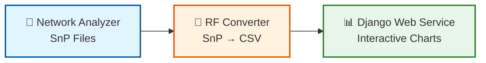

# Simple Linear Flow - 가장 심플한 워크플로우

**용도**: 간단한 보고서, 빠른 설명
**대상**: 모든 사람

---

## 다이어그램

---

## 설명

가장 간단한 3단계 플로우:

1. **📡 Network Analyzer** - S-parameter 측정 → SnP 파일 생성
2. **🔄 RF Converter** - SnP 파일 → CSV 변환 (주파수 필터링)
3. **📊 Django Web Service** - CSV 데이터 → 인터랙티브 차트

---

## 특징

- ✅ 3박스로 끝
- ✅ 5초만에 이해 가능
- ✅ PPT 1장에 딱 맞음
- ✅ 비기술직도 쉽게 이해

---

**파일명**: `01-simple-linear-flow.md`
**생성일**: 2025-10-27
