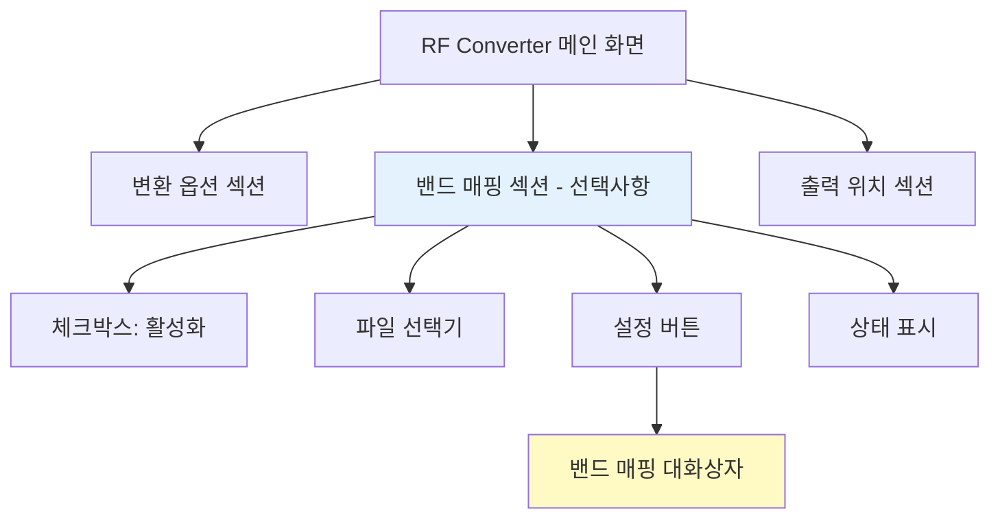
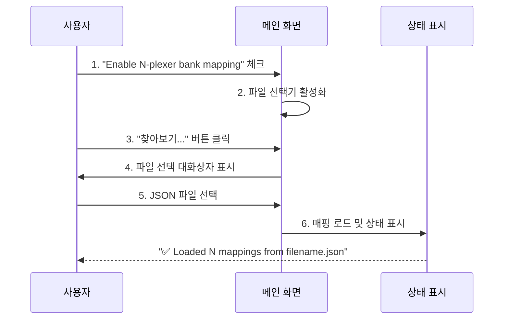
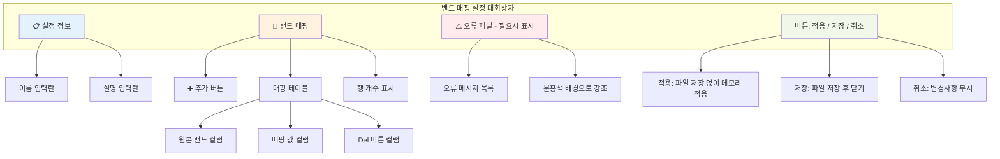
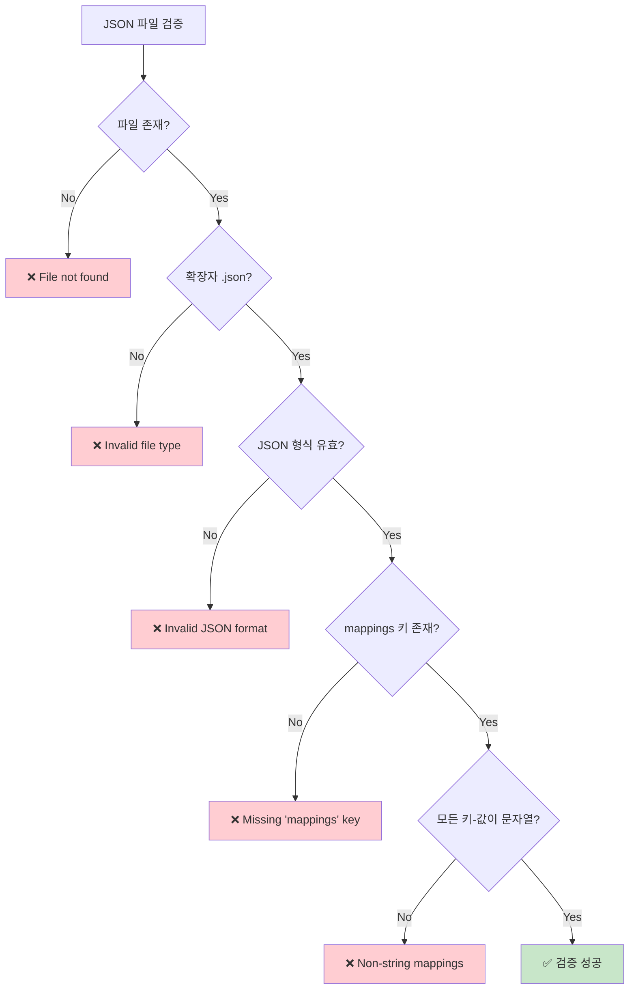
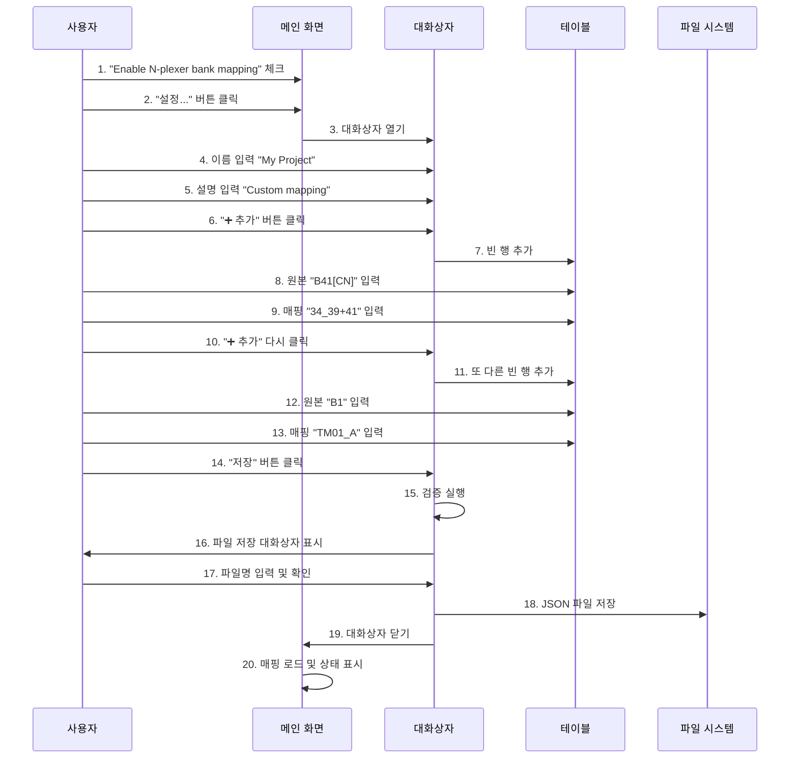
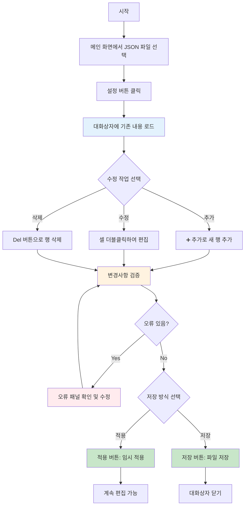
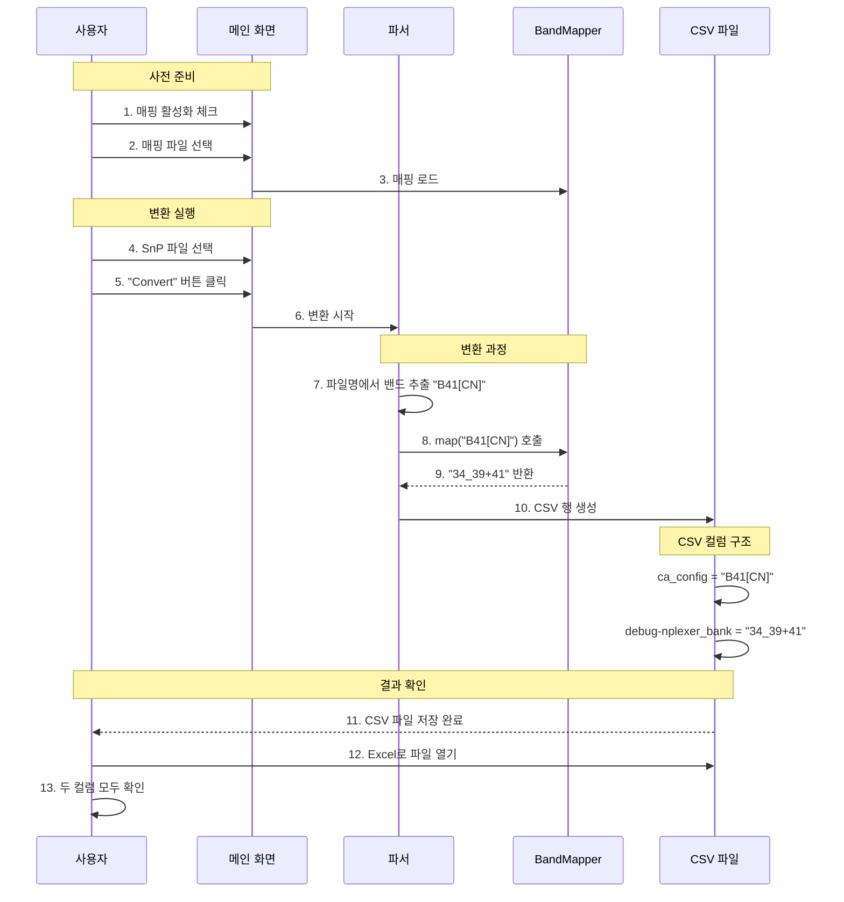

# RF Converter - 밴드 매핑 설정 사용 설명서

**버전**: 1.1
**최종 수정**: 2025-11-27
**대상 사용자**: RF 엔지니어, 측정 엔지니어

---

## 📚 목차

1. [개요](#개요)
2. [기능 소개](#기능-소개)
3. [시작하기](#시작하기)
4. [밴드 매핑 대화상자 사용법](#밴드-매핑-대화상자-사용법)
5. [JSON 설정 파일 형식](#json-설정-파일-형식)
6. [단계별 튜토리얼](#단계별-튜토리얼)
7. [사용 사례](#사용-사례)
8. [문제 해결](#문제-해결)
9. [FAQ](#faq)

---

## 개요

### 밴드 매핑이란?

**밴드 매핑(Band Mapping)**은 서로 다른 측정 현장에서 사용하는 밴드 표기법을 통일하는 기능입니다.

### 문제 상황

측정 데이터를 분석할 때 다음과 같은 문제가 발생할 수 있습니다:

```
현장 A의 SnP 파일명:  "B41[CN]_RxGain_G0H.s2p"
현장 B의 비교 데이터:  N-plexer bank "34_39+41"

→ 같은 밴드인데 표기가 달라서 자동 비교가 불가능!
```

### 해결 방법

밴드 매핑 설정 파일(JSON)을 사용하여 자동 변환:

```
원본 표기    →  매핑 후 표기
B41[CN]      →  34_39+41
B41[SA]      →  41
B1[B7]       →  1[7]_CA
```

### 주요 이점

- ✅ **자동 변환**: 수동 편집 없이 표기 통일
- ✅ **데이터 비교**: 서로 다른 현장 데이터를 동일한 기준으로 비교
- ✅ **유연성**: 프로젝트별 맞춤 설정 가능
- ✅ **비파괴적**: 원본 표기도 CSV에 함께 저장

---

## 기능 소개

### 메인 화면 통합

밴드 매핑 기능은 RF Converter 메인 화면에 선택적(Optional) 기능으로 통합되어 있습니다.



### 밴드 매핑 대화상자

설정 버튼을 클릭하면 나타나는 전용 편집 대화상자:

- 📋 **설정 정보**: 이름 및 설명 입력
- 🔀 **밴드 매핑 테이블**: 원본-매핑 쌍 편집
- ⚠️ **실시간 검증**: 오류 자동 감지 및 표시
- 💾 **파일 관리**: 불러오기/저장 기능

---

## 시작하기

### 1. 메인 화면에서 활성화



### 2. 설정 버튼으로 편집

체크박스를 활성화한 후 "설정..." 버튼을 클릭하여 대화상자를 엽니다.

> **참고**: 체크박스가 비활성화되어 있으면 설정 버튼도 비활성화됩니다.

### 3. 변환 실행

매핑이 활성화된 상태로 변환을 실행하면, 출력 CSV 파일에 다음 두 컬럼이 모두 포함됩니다:

- `ca_config`: 원본 밴드 표기 (예: B41[CN])
- `debug-nplexer_bank`: 매핑된 표기 (예: 34_39+41)

---

## 밴드 매핑 대화상자 사용법

### 대화상자 구조



### 화면 구성 요소

#### 1. 📋 설정 정보 섹션

| 필드 | 설명 | 예시 |
|------|------|------|
| **이름** | 매핑 설정의 이름 | Alpha1C EVB1 Site |
| **설명** | 매핑 용도 설명 | Mapping for Alpha1C EVB1 test site |

> **팁**: 이름과 설명을 명확하게 작성하면 나중에 여러 매핑 파일을 구분하기 쉽습니다.

#### 2. 🔀 밴드 매핑 섹션

**툴바**:
- **➕ 추가 버튼**: 새로운 매핑 행 추가

**테이블 컬럼**:
- **원본 밴드**: SnP 파일명의 밴드 표기 (예: B41[CN], B1, N77)
- **매핑 값**: 변환될 N-plexer bank 표기 (예: 34_39+41, TM01_A)
- **Del**: 해당 행 삭제 버튼

**하단 정보**:
- 총 매핑 개수 표시 (예: "5 rows")

#### 3. ⚠️ 오류 패널 (조건부 표시)

검증 오류가 있을 때만 표시되며, 다음과 같은 오류를 실시간으로 표시합니다:

- ❌ 빈 필드 (원본 밴드 또는 매핑 값)
- ❌ 중복된 원본 밴드
- ⚠️ 최대 5개 오류까지 표시 (이상은 개수로 표시)

**오류 행 강조**:
- 오류가 있는 행은 분홍색 배경으로 자동 강조됩니다.

#### 4. 버튼 영역

| 버튼 | 기능 | 동작 |
|------|------|------|
| **적용** | 임시 적용 | 파일 저장 없이 BandMapper에 매핑 적용<br>대화상자는 열린 상태 유지 |
| **저장** | 저장 후 닫기 | 파일에 저장하고 대화상자 닫기 |
| **취소** | 닫기 | 변경사항 무시하고 닫기<br>미저장 변경사항이 있으면 확인 메시지 표시 |

---

## JSON 설정 파일 형식

### 기본 구조

```json
{
  "schema_version": "1.0",
  "name": "설정 이름",
  "description": "설명 텍스트",
  "mappings": {
    "원본표기1": "매핑표기1",
    "원본표기2": "매핑표기2"
  }
}
```

### 필수/선택 필드

| 필드 | 필수 여부 | 설명 | 기본값 |
|------|-----------|------|--------|
| `schema_version` | **필수** | 스키마 버전 (현재 "1.0") | - |
| `mappings` | **필수** | 밴드 매핑 딕셔너리 | - |
| `name` | 선택 | 설정 이름 | "" |
| `description` | 선택 | 설정 설명 | "" |

### 검증 규칙



### 예제 파일

#### 예제 1: 기본 매핑 (`example_basic.json`)

```json
{
  "schema_version": "1.0",
  "name": "Basic Mapping",
  "description": "Basic band mapping example",
  "mappings": {
    "B1": "TM01_A",
    "B3": "TM03_A",
    "B7": "TM07_A",
    "B41": "TM41_A",
    "N77": "TN77_A"
  }
}
```

**용도**: 단순 프로젝트용 5개 밴드 매핑

#### 예제 2: 지역별 B41 매핑 (`example_alpha1c_evb1.json`)

```json
{
  "schema_version": "1.0",
  "name": "Alpha-1C EVB#1",
  "description": "Alpha-1C EVB#1 N-plexer bank mappings",
  "mappings": {
    "B41[CN]": "34_39+41",
    "B41[SA]": "41",
    "B41[NA]": "25_30_66+41",
    "B41[EU]": "41_EU"
  }
}
```

**용도**: 지역별 B41 CA(Carrier Aggregation) 조합 구분

#### 예제 3: 전체 밴드 매핑 (`example_comprehensive.json`)

```json
{
  "schema_version": "1.0",
  "name": "Multi-band PA Module",
  "description": "Comprehensive mapping for all common LTE and 5G NR bands",
  "mappings": {
    "B1": "TM01_A",
    "B2": "TM02_A",
    "B3": "TM03_A",
    // ... 50개 밴드 ...
    "N77": "TN77_A",
    "N78": "TN78_A",
    "N79": "TN79_A"
  }
}
```

**용도**: 멀티밴드 PA 모듈용 50개 밴드 전체 매핑

---

## 단계별 튜토리얼

### 튜토리얼 1: 처음부터 새로운 매핑 만들기



#### 단계별 상세 설명

**1-2단계: 대화상자 열기**
- 메인 화면에서 "Enable N-plexer bank mapping" 체크박스 활성화
- "설정..." 버튼 클릭
- 빈 대화상자가 열림 (처음 사용 시)

**3-4단계: 설정 정보 입력**
```
이름: My Project Mapping
설명: Custom mapping for Alpha-1C EVB#1 test site
```

**5-7단계: 첫 번째 매핑 추가**
1. "➕ 추가" 버튼 클릭
2. 첫 번째 행이 나타남
3. "원본 밴드" 셀에 `B41[CN]` 입력
4. "매핑 값" 셀에 `34_39+41` 입력
5. Enter 또는 Tab으로 다음 필드로 이동

**8-10단계: 추가 매핑 입력**
- 같은 방식으로 필요한 만큼 매핑 추가
- 예시:
  ```
  B41[SA] → 41
  B1      → TM01_A
  N77     → TN77_A
  ```

**11-13단계: 저장**
1. "저장" 버튼 클릭
2. 자동 검증 실행
3. 검증 통과 시 파일 저장 대화상자 표시
4. 파일명 입력 (예: `my_project_mapping.json`)
5. 저장 위치 선택 (권장: `Documents\RF_Converter\mappings\`)
6. "저장" 확인

**완료**: 대화상자가 닫히고 메인 화면에 상태 표시
```
✅ Loaded 4 mappings from my_project_mapping.json
```

### 튜토리얼 2: 기존 매핑 파일 수정하기



#### 단계별 상세 설명

**1단계: 파일 로드**
- 메인 화면에서 "찾아보기..." 클릭
- 수정할 JSON 파일 선택 (예: `example_basic.json`)
- 상태 표시: "✅ Loaded 5 mappings from example_basic.json"

**2단계: 대화상자 열기**
- "설정..." 버튼 클릭
- 기존 매핑 내용이 테이블에 표시됨

**3단계: 수정 작업**

**옵션 A - 새 매핑 추가**:
```
"➕ 추가" 클릭
→ B66 입력
→ TM66_A 입력
```

**옵션 B - 기존 매핑 수정**:
```
B7 행의 "TM07_A" 셀 더블클릭
→ "7" 로 변경
→ Enter
```

**옵션 C - 매핑 삭제**:
```
B3 행의 "Del" 버튼 클릭
→ 행 즉시 삭제
```

**4단계: 검증 확인**
- 수정 중 실시간 검증 실행
- 오류 발생 시:
  - 오류 행 분홍색 배경 표시
  - 하단 오류 패널에 메시지 표시
  - 예: "Row 3: 원본 밴드를 입력하세요"

**5단계: 저장 선택**

**옵션 1 - 적용 (임시)**:
- "적용" 버튼 클릭
- BandMapper에 즉시 반영
- 파일은 저장하지 않음
- 대화상자는 열린 상태
- 계속 편집 가능

**옵션 2 - 저장 (영구)**:
- "저장" 버튼 클릭
- 기존 파일에 덮어쓰기 (백업 자동 생성: `.bak`)
- 대화상자 자동 닫기

> **주의**: "적용"만 하고 "저장"하지 않으면 프로그램 재시작 시 변경사항이 사라집니다.

### 튜토리얼 3: 변환 실행 및 결과 확인



#### CSV 출력 예시

변환 후 생성되는 CSV 파일 구조:

```csv
Freq Type,RAT,Cfg Band,Debug Band,Frequency,Active RF Path,Gain (dB),Reverse (dB),Input RL (dB),Output RL (dB),cfg_lna_gain_state,cfg_active_port_1,cfg_active_port_2,ca_config,debug-nplexer_bank
Rx,LTE,B41,B41,2545.0,Main,25.5,-30.2,-15.3,-18.7,G0_H,PRX,OFF,B41[CN],34_39+41
Rx,LTE,B41,B41,2555.0,Main,25.3,-30.5,-15.1,-18.5,G0_H,PRX,OFF,B41[CN],34_39+41
Rx,LTE,B41,B41,2565.0,Main,25.6,-30.1,-15.4,-18.9,G0_H,PRX,OFF,B41[CN],34_39+41
```

**중요 컬럼**:
- `ca_config`: **원본** 밴드 표기 (B41[CN])
- `debug-nplexer_bank`: **매핑된** N-plexer 표기 (34_39+41)

#### 결과 활용

**Excel에서 필터링**:
```
1. Excel로 CSV 열기
2. 데이터 → 필터
3. "debug-nplexer_bank" 컬럼으로 필터
4. "34_39+41" 선택
→ 모든 B41[CN] 데이터만 표시
```

**비교 분석**:
```
현장 A 데이터: ca_config = "B41[CN]"
현장 B 데이터: ca_config = "B41"
→ 둘 다 debug-nplexer_bank = "34_39+41"로 통일
→ 그래프에서 동일한 범주로 비교 가능
```

---

## 사용 사례

### 사례 1: 다국가 프로젝트

**상황**:
- 중국(CN), 남미(SA), 북미(NA) 3개 지역에서 B41 측정
- 각 지역마다 다른 CA 조합 사용
- 데이터를 지역별로 비교 필요

**해결**:

```json
{
  "schema_version": "1.0",
  "name": "Multi-Region B41 Project",
  "description": "Regional B41 CA configurations",
  "mappings": {
    "B41[CN]": "34_39+41",
    "B41[SA]": "41",
    "B41[NA]": "25_30_66+41"
  }
}
```

**결과**:
```
파일명: B41[CN]_RxGain.s2p → debug-nplexer_bank: "34_39+41"
파일명: B41[SA]_RxGain.s2p → debug-nplexer_bank: "41"
파일명: B41[NA]_RxGain.s2p → debug-nplexer_bank: "25_30_66+41"

→ Excel에서 지역별 그룹화 가능
→ 피벗 테이블로 지역별 성능 비교
```

### 사례 2: 고객사 표준 통일

**상황**:
- 내부 표준: B1, B3, B7 (3GPP 표준)
- 고객사 표준: TM01_A, TM03_A, TM07_A (자체 명명 규칙)
- 고객사 측정 데이터와 비교 필요

**해결**:

```json
{
  "schema_version": "1.0",
  "name": "Customer Site Mapping",
  "description": "Map 3GPP bands to customer TM notation",
  "mappings": {
    "B1": "TM01_A",
    "B3": "TM03_A",
    "B7": "TM07_A",
    "B20": "TM20_A",
    "B28": "TM28_A"
  }
}
```

**활용**:
```
내부 측정: B1_RxGain.s2p
→ CSV: ca_config="B1", debug-nplexer_bank="TM01_A"

고객 데이터: TM01_A_Reference.csv
→ 컬럼명: "TM01_A"

→ 두 파일을 "TM01_A" 기준으로 병합 가능
→ 자동화된 비교 분석 스크립트 작성 가능
```

### 사례 3: CA(Carrier Aggregation) 구성 명시

**상황**:
- B1+B7 CA 구성 측정
- 파일명: B1[B7]_RxGain.s2p
- N-plexer bank 표기: 1[7]_CA

**해결**:

```json
{
  "schema_version": "1.0",
  "name": "CA Configuration Mapping",
  "description": "Map CA configurations to N-plexer banks",
  "mappings": {
    "B1": "TM01_A",
    "B7": "TM07_A",
    "B1[B7]": "1[7]_CA",
    "B3[B7]": "3[7]_CA",
    "B7[B20]": "7[20]_CA"
  }
}
```

**결과**:
```
단일 밴드:
B1_RxGain.s2p → TM01_A
B7_RxGain.s2p → TM07_A

CA 구성:
B1[B7]_RxGain.s2p → 1[7]_CA
B3[B7]_RxGain.s2p → 3[7]_CA

→ 단일/CA를 명확히 구분
→ CA 성능 vs 단일 밴드 성능 비교 용이
```

---

## 문제 해결

### 문제 1: 검증 오류 - 빈 필드

**증상**:
```
⚠️ 1개 오류 발견:
• Row 3: 원본 밴드를 입력하세요
```

**원인**:
- 테이블 행에 원본 밴드 또는 매핑 값이 비어있음

**해결**:
1. 오류 패널에서 행 번호 확인
2. 해당 행이 분홍색으로 강조되어 있음
3. 빈 셀에 값 입력 또는 Del 버튼으로 행 삭제

**예시**:
```
Row 3:
원본 밴드: [비어있음]  ← 오류
매핑 값: TM03_A

→ "B3" 입력 또는 행 삭제
```

### 문제 2: 검증 오류 - 중복 키

**증상**:
```
⚠️ 1개 오류 발견:
• Row 5: 중복된 원본 밴드 "B41" (row 2에 이미 존재)
```

**원인**:
- 동일한 원본 밴드가 여러 행에 존재
- 하나의 원본 밴드는 하나의 매핑 값만 가질 수 있음

**해결**:
1. Row 2와 Row 5 확인
2. 중복 행 중 하나를 삭제 또는 수정

**예시**:
```
Row 2: B41 → TM41_A
Row 5: B41 → 34_39+41  ← 중복!

→ 의도 확인:
  - 일반 B41은 TM41_A
  - B41[CN]은 34_39+41

→ Row 5를 "B41[CN]" → "34_39+41"로 수정
```

### 문제 3: 파일 로드 실패

**증상**:
```
❌ Invalid JSON format: Expecting ',' delimiter: line 8 column 3
```

**원인**:
- JSON 문법 오류 (쉼표 누락, 괄호 불일치 등)

**해결**:
1. JSON 유효성 검사기 사용 (예: jsonlint.com)
2. 텍스트 에디터로 파일 열기
3. 오류 위치(line 8) 확인
4. 문법 수정 후 다시 로드

**흔한 JSON 오류**:
```json
// ❌ 잘못된 예
{
  "mappings": {
    "B1": "TM01_A"   ← 마지막 항목 뒤 쉼표 제거
    "B3": "TM03_A",  ← 쉼표 추가 필요
  }
}

// ✅ 올바른 예
{
  "mappings": {
    "B1": "TM01_A",
    "B3": "TM03_A"
  }
}
```

### 문제 4: 매핑이 적용되지 않음

**증상**:
- 변환은 성공했지만 CSV의 `debug-nplexer_bank`가 원본과 동일

**원인 1 - 체크박스 비활성화**:
```
메인 화면:
[ ] Enable N-plexer bank mapping  ← 체크 안 됨!
```

**해결**: 체크박스 활성화

**원인 2 - 매핑 키 없음**:
```
파일명: B41[EU]_RxGain.s2p
매핑 파일에 B41[EU] 없음
→ debug-nplexer_bank = "B41[EU]" (원본 그대로)
```

**해결**:
1. 로그 확인 (`~/.rf_converter/logs/rf_converter.log`)
```
WARNING - No mapping found for 'B41[EU]', using original value.
Add to mapping file: my_mapping.json
```
2. 대화상자에서 `B41[EU]` 매핑 추가

**원인 3 - 적용만 하고 저장 안 함**:
```
1. 대화상자에서 매핑 편집
2. "적용" 버튼 클릭
3. 프로그램 종료
4. 다시 실행 → 매핑 사라짐!
```

**해결**: "적용" 후 반드시 "저장" 클릭

### 문제 5: 한글 깨짐

**증상**:
- JSON 파일의 한글 설명이 깨져서 표시됨

**원인**:
- 텍스트 에디터가 UTF-8이 아닌 다른 인코딩으로 저장

**해결**:
1. 텍스트 에디터에서 파일 열기
2. 인코딩을 UTF-8로 변경하여 저장
3. 다시 로드

**권장 에디터**:
- VS Code: 기본 UTF-8
- Notepad++: Format → UTF-8
- Windows 메모장: 저장 시 "UTF-8" 선택

---

## FAQ

### Q1: 매핑 파일은 어디에 저장해야 하나요?

**A**: 세 가지 옵션이 있습니다.

**옵션 1 - 공용 매핑** (권장):
```
C:\Python\Project\rx-gain-viewer\rf_converter\core\mappings\
```
- 팀 전체가 사용하는 표준 매핑
- Git으로 버전 관리

**옵션 2 - 개인 매핑**:
```
C:\Users\{사용자명}\.rf_converter\mappings\
```
- 개인만 사용하는 매핑
- Git에 포함되지 않음

**옵션 3 - 프로젝트 매핑**:
```
C:\Projects\AlphaProject\data\mappings\
```
- 특정 프로젝트 전용
- 프로젝트 데이터와 함께 관리

> **팁**: 파일명에 프로젝트/현장명 포함 (예: `alpha1c_evb1_mapping.json`)

### Q2: 매핑 없이 변환하면 어떻게 되나요?

**A**: 전혀 문제없습니다.

```csv
ca_config,debug-nplexer_bank
B41[CN],B41[CN]    ← 동일하게 유지
B1,B1
N77,N77
```

- 매핑 기능은 **선택사항(Optional)**
- 비활성화 시 두 컬럼이 동일한 값으로 채워짐
- 기존 워크플로우에 영향 없음

### Q3: 매핑 파일을 팀원과 공유하려면?

**A**: JSON 파일만 공유하면 됩니다.

**방법 1 - Git 사용**:
```bash
# 매핑 파일 커밋
git add rf_converter/core/mappings/team_mapping.json
git commit -m "Add team mapping configuration"
git push

# 팀원이 받기
git pull
```

**방법 2 - 파일 공유**:
```
1. JSON 파일을 이메일/Slack으로 전송
2. 팀원이 RF Converter 설치 폴더에 저장
3. GUI에서 "찾아보기..." → 파일 선택
```

**방법 3 - 네트워크 드라이브**:
```
공용 폴더: \\server\RFTeam\Mappings\
각자 이 폴더의 파일을 선택하여 사용
```

### Q4: 한 번에 여러 매핑 파일을 사용할 수 있나요?

**A**: 아니오, 한 번에 하나의 매핑 파일만 사용 가능합니다.

**대안**:
- 여러 매핑을 하나의 파일로 병합

```json
{
  "name": "Combined Mapping",
  "description": "Project A + Project B mappings",
  "mappings": {
    "B41[CN]": "34_39+41",    // Project A
    "B41[SA]": "41",          // Project A
    "B1": "TM01_A",           // Project B
    "B3": "TM03_A"            // Project B
  }
}
```

### Q5: 매핑을 잘못 설정했는데 되돌릴 수 있나요?

**A**: 여러 방법이 있습니다.

**방법 1 - 백업 파일 사용**:
```
저장 시 자동으로 .bak 파일 생성
예: my_mapping.json.bak

→ .bak 확장자 제거하여 복원
```

**방법 2 - Git 사용**:
```bash
git checkout rf_converter/core/mappings/team_mapping.json
```

**방법 3 - 대화상자에서 수정**:
```
1. 파일 로드
2. 잘못된 행 Del 버튼으로 삭제
3. 올바른 매핑 다시 추가
4. 저장
```

### Q6: 매핑 파일 없이 "적용"만 할 수 있나요?

**A**: 네, 가능합니다.


**용도**:
- 테스트용 임시 매핑
- 매핑 효과 미리보기
- 실험적 설정

**주의**:
- "적용"만 하면 프로그램 종료 시 사라짐
- 계속 사용하려면 반드시 "저장" 필요

### Q7: 매핑 파일 형식을 바꿀 수 있나요?

**A**: 현재는 JSON만 지원하지만, 쉽게 변환 가능합니다.

**Excel → JSON 변환**:
```excel
원본 밴드    매핑 값
B41[CN]     34_39+41
B1          TM01_A
```

→ 수동으로 JSON 작성:
```json
{
  "schema_version": "1.0",
  "name": "From Excel",
  "description": "",
  "mappings": {
    "B41[CN]": "34_39+41",
    "B1": "TM01_A"
  }
}
```

> **향후 계획**: Excel/CSV 가져오기 기능 추가 예정

### Q8: 대화상자 없이 JSON 파일을 직접 편집해도 되나요?

**A**: 네, 가능합니다.

**장점**:
- 빠른 대량 편집
- 버전 관리 시스템 활용
- 스크립트로 자동 생성 가능

**단점**:
- 문법 오류 위험
- 실시간 검증 없음

**권장 워크플로우**:
```
1. 텍스트 에디터로 JSON 편집
2. JSON 유효성 검사 (jsonlint.com)
3. RF Converter에서 파일 로드
4. 오류 발생 시 로그 확인
5. 필요 시 대화상자에서 미세 조정
```

### Q9: 성능에 영향이 있나요?

**A**: 거의 없습니다.

**성능 특성**:
- 로드 시간: <50ms (50개 매핑 기준)
- 조회 시간: <1ms (O(1) 딕셔너리 조회)
- 메모리: ~5KB (50개 매핑 기준)

**대량 변환**:
```
1000개 파일 변환:
- 매핑 없음: 45초
- 매핑 있음: 45.5초
→ 영향: 0.5초 (1% 미만)
```

### Q10: 매핑 로그는 어디서 확인하나요?

**A**: 두 곳에서 확인 가능합니다.

**Python 로그**:
```
위치: C:\Users\{사용자명}\.rf_converter\logs\rf_converter.log

내용:
INFO - Successfully loaded 5 mappings from example_basic.json
WARNING - No mapping found for 'B41[EU]', using original value.
```

**JSON 히스토리**:
```
위치: C:\Users\{사용자명}\.rf_converter\logs\conversion_history.json

내용:
{
  "timestamp": "2025-11-27T14:30:00",
  "files_converted": 10,
  "mapping_enabled": true,
  "mapping_file": "example_basic.json",
  "unmapped_bands": ["B41[EU]"]
}
```

---

## 부록 A: 바로가기 키보드 단축키

현재 대화상자는 마우스 중심 UI입니다. 키보드 단축키는 향후 버전에서 추가될 예정입니다.

**현재 지원**:
- **Tab**: 다음 필드로 이동
- **Shift+Tab**: 이전 필드로 이동
- **Enter**: 셀 편집 완료
- **Esc**: 대화상자 닫기 (취소 확인 메시지 표시)

---

## 부록 B: 고급 JSON 패턴

### 패턴 1: 와일드카드 매핑 (향후 지원 예정)

```json
{
  "schema_version": "2.0",
  "mappings": {
    "B41[*]": "41_Global",
    "B*": "TM{band}_A"
  }
}
```

### 패턴 2: 조건부 매핑 (향후 지원 예정)

```json
{
  "schema_version": "2.0",
  "mappings": {
    "B41": {
      "default": "TM41_A",
      "conditions": {
        "region:CN": "34_39+41",
        "region:SA": "41"
      }
    }
  }
}
```

---

## 부록 C: 에러 코드 참조

| 코드 | 메시지 | 의미 | 해결 |
|------|--------|------|------|
| E001 | File not found | 파일 경로 오류 | 파일 존재 확인 |
| E002 | Invalid file type | .json 아님 | 확장자 확인 |
| E003 | Invalid JSON format | JSON 문법 오류 | JSON 검증기 사용 |
| E004 | Missing 'mappings' key | 필수 키 누락 | mappings 키 추가 |
| E005 | Non-string mappings | 문자열 아님 | 모든 값을 문자열로 변경 |
| W001 | Schema version mismatch | 버전 불일치 | 경고만, 계속 진행 |
| W002 | No mapping found | 키 없음 | 매핑 추가 또는 무시 |

---

## 부록 D: 프로젝트별 권장 매핑 전략

### 소규모 프로젝트 (< 10 밴드)
```json
{
  "name": "Small Project",
  "mappings": {
    "B1": "Band_1",
    "B3": "Band_3",
    "B7": "Band_7"
  }
}
```

### 중규모 프로젝트 (10-30 밴드)
- 지역별 파일 분리
- `mapping_CN.json`, `mapping_SA.json`

### 대규모 프로젝트 (> 30 밴드)
- 통합 매핑 파일 사용
- `example_comprehensive.json` 참고

---

## 부록 E: 웹 마이그레이션 가이드

이 문서를 웹 페이지로 전환 시 고려사항:

### HTML 구조
```html
<nav>목차</nav>
<main>
  <section id="개요">...</section>
  <section id="기능-소개">...</section>
  <section id="튜토리얼">...</section>
</main>
<aside>빠른 참조</aside>
```

### 대화형 요소
- Mermaid 다이어그램 → 인터랙티브 SVG
- 코드 블록 → 복사 버튼 추가
- 스크린샷 → 이미지 갤러리
- FAQ → 접기/펼치기 UI

### 검색 기능
- 전체 텍스트 검색
- 태그 기반 필터링
- 관련 항목 추천

---

## 문서 정보

**작성일**: 2025-11-27
**작성자**: RF Converter 개발팀
**대상 독자**: RF 엔지니어, 측정 엔지니어
**문서 버전**: 1.0
**소프트웨어 버전**: RF Converter v1.1

**피드백**:
- 문의사항이나 개선 제안은 개발팀에 문의하세요.
- 이 문서는 지속적으로 업데이트됩니다.

---

**문서 끝**
