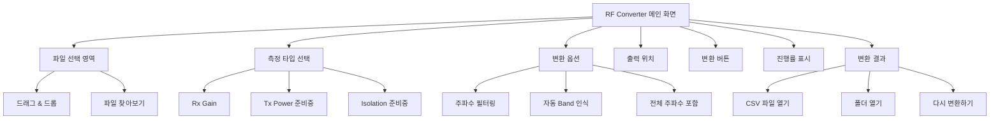
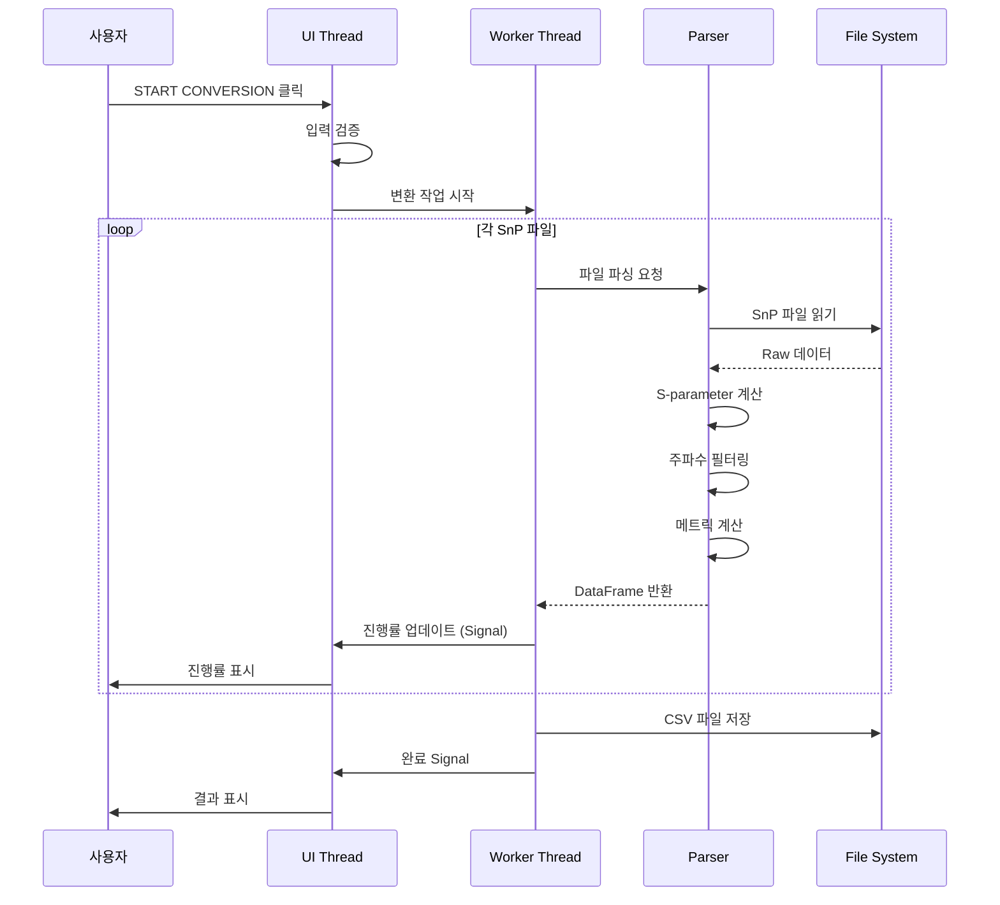
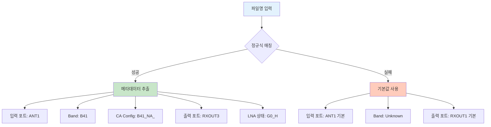
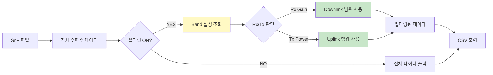
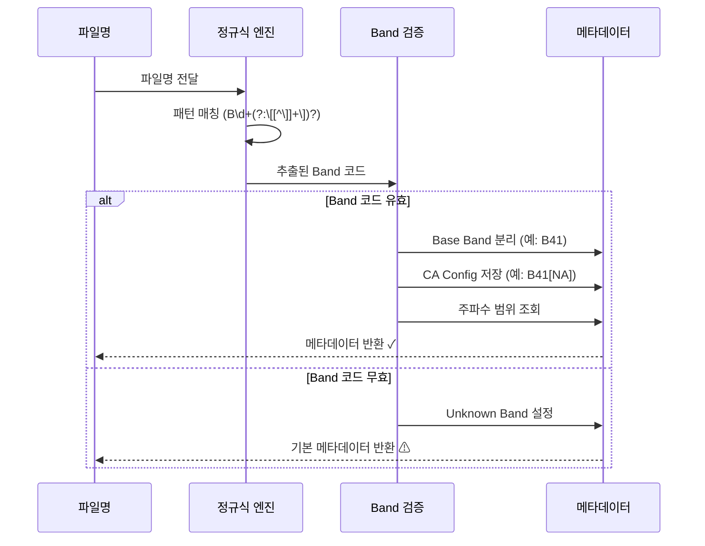
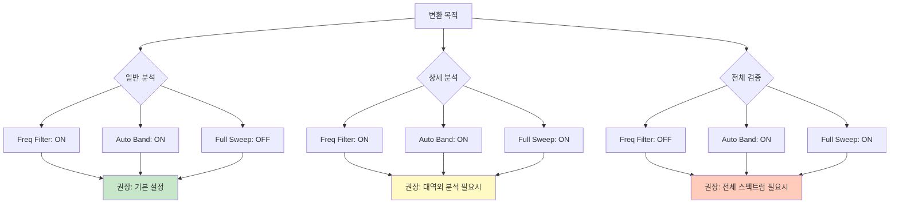
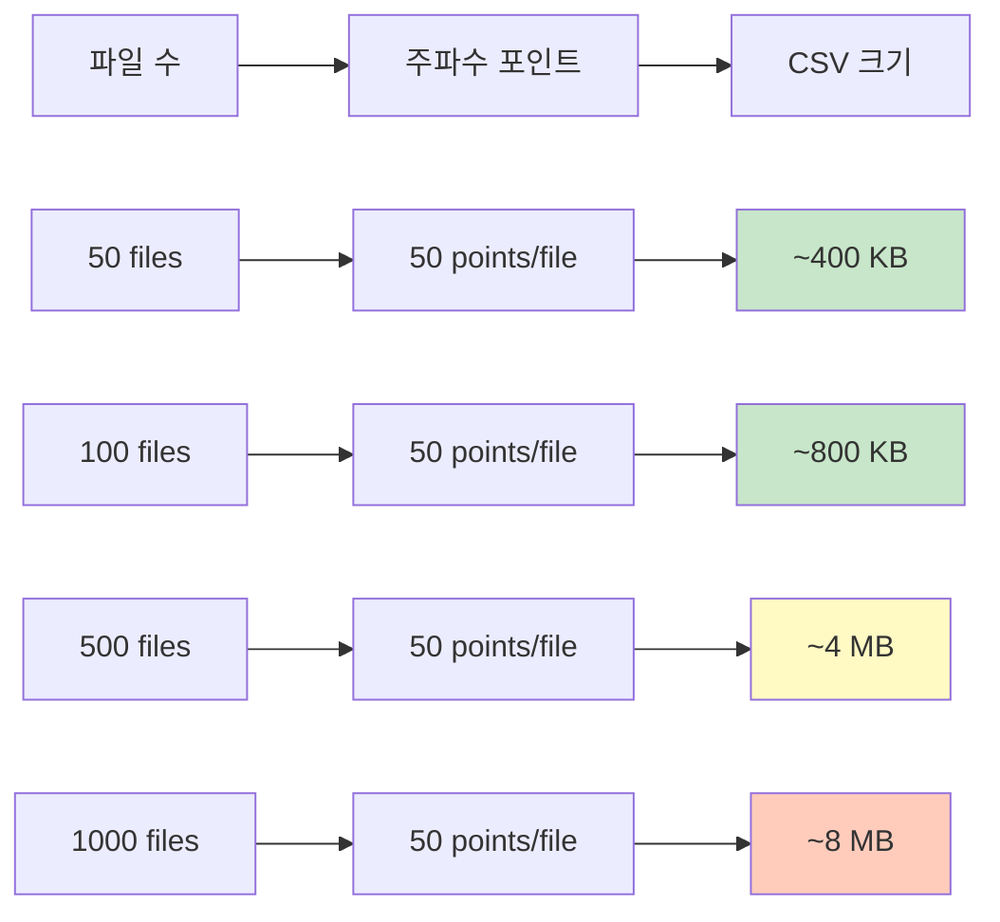
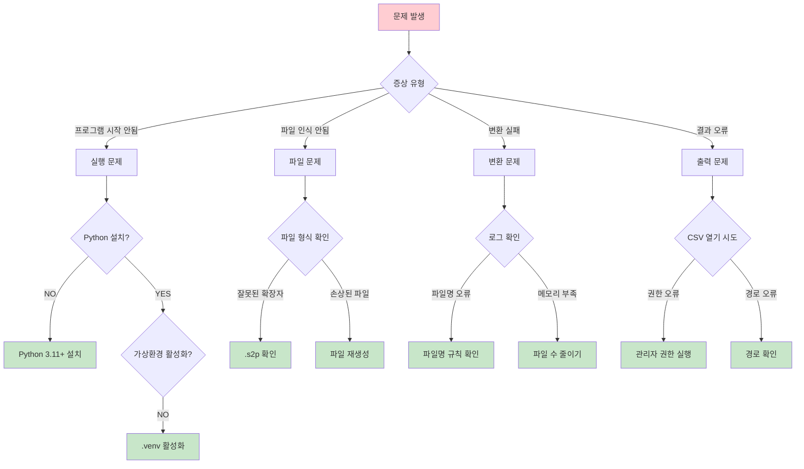

# RF Converter 사용자 매뉴얼

> ⚡ **빠르게 시작하기**: [RF Converter 빠른 가이드](USER_MANUAL_QUICKSTART_KR.md) (5분 완성)
>
> 🆕 **Band Mapping 기능**
> - **빠른 시작**: [Band Mapping 빠른 가이드](BAND_MAPPING_QUICKSTART_KR.md) (5분)
> - **상세 매뉴얼**: [Band Mapping 완전 가이드](BAND_MAPPING_MANUAL_KR.md) (고급 기능, FAQ)

---

## 목차
1. [프로그램 소개](#1-프로그램-소개)
2. [빠른 시작 가이드](#2-빠른-시작-가이드)
3. [상세 기능 설명](#3-상세-기능-설명)
4. [파일명 규칙 및 자동 인식](#4-파일명-규칙-및-자동-인식)
5. [설정 옵션 상세](#5-설정-옵션-상세)
6. [지원 Band 목록](#6-지원-band-목록)
7. [출력 CSV 형식](#7-출력-csv-형식)
8. [문제 해결](#8-문제-해결)
9. [로그 및 설정 파일](#9-로그-및-설정-파일)

---

## 1. 프로그램 소개

### 1.1 개요
**RF Converter**는 RF 측정 장비에서 생성된 S-parameter 파일(SnP)을 CSV 형식으로 변환하는 전문 도구입니다. PA(Power Amplifier) 모듈 테스트 결과를 분석하고 리포팅하기 위해 개발되었습니다.

### 1.2 주요 특징
- ✅ **다중 파일 형식 지원**: S1P, S2P, S3P, S4P 파일
- ✅ **3GPP Band 필터링**: 48개 LTE/5G NR 대역 지원
- ✅ **자동 Band 인식**: 파일명에서 자동으로 Band 정보 추출
- ✅ **지역 코드 지원**: B41[NA], B41[EU] 등 지역별 설정
- ✅ **CA 설정 인식**: B1[B7], B3[B7] 등 Carrier Aggregation 패턴
- ✅ **배치 변환**: 여러 파일을 한 번에 처리
- ✅ **실시간 진행률**: 파일별 처리 상태 표시
- ✅ **설정 저장**: 마지막 설정 자동 복원

### 1.3 시스템 요구사항
- **운영체제**: Windows 10/11 (64-bit)
- **Python**: 3.11 이상
- **메모리**: 최소 4GB RAM
- **디스크 공간**: 50MB (프로그램) + 변환 파일 크기

### 1.4 프로그램 화면 구성



---

## 2. 빠른 시작 가이드

### 2.1 프로그램 실행 (3가지 방법)

**방법 1: 배치 파일 실행 (가장 간단)**
```bash
# 프로젝트 폴더에서 run_gui.bat 더블클릭
C:\Python\Project\rx-gain-viewer\run_gui.bat
```

**방법 2: Python 직접 실행**
```bash
cd C:\Python\Project\rx-gain-viewer
.venv\Scripts\python.exe rf_converter\ui_pyqt6\main.py
```

**방법 3: UV 실행**
```bash
cd C:\Python\Project\rx-gain-viewer
uv run rf_converter/ui_pyqt6/main.py
```

### 2.2 5단계 빠른 변환


**단계별 설명:**

1. **프로그램 실행**: `run_gui.bat` 더블클릭

2. **파일 선택**:
   - 드래그 & 드롭: SnP 파일들을 화면에 드래그
   - 또는 "파일 찾아보기" 버튼 클릭 후 선택

3. **출력 경로 확인**:
   - 기본값: `바탕화면\RF_Output.csv`
   - 필요시 "Browse..." 버튼으로 변경

4. **변환 시작**:
   - 녹색 "START CONVERSION" 버튼 클릭
   - 진행률 표시줄에서 실시간 상태 확인

5. **결과 확인**:
   - "Open CSV" 버튼: 변환된 CSV 파일 열기
   - "Open Folder" 버튼: 파일이 저장된 폴더 열기

### 2.3 기본 사용 예시

```
입력 파일:
- X_ANT1_B1@1_(G0H).s2p
- X_ANT1_B3@1_(G0H).s2p
- X_ANT2_B7@2_(G1L).s2p

설정:
- Measurement Type: Rx Gain ✓
- Frequency filtering: ON ✓
- Auto-detect band: ON ✓
- Full frequency sweep: OFF

출력:
- C:\Users\사용자명\Desktop\RF_Output.csv
- 총 150 rows (각 Band별 50 주파수 포인트)
```

---

## 3. 상세 기능 설명

### 3.1 파일 선택 영역

**위치**: 화면 상단 "File Selection" 그룹박스

**기능**:
- 파일 드래그 & 드롭 지원
- 다중 파일 선택 가능
- 지원 형식: `.s1p`, `.s2p`, `.s3p`, `.s4p`
- 선택된 파일 수와 총 크기 표시

**사용 방법**:
1. Windows 탐색기에서 SnP 파일 선택
2. RF Converter 창의 "File Selection" 영역으로 드래그
3. 또는 "Browse files..." 버튼 클릭 후 파일 선택

**팁**:
- Ctrl 키를 누른 채로 파일 여러 개 선택 가능
- 폴더 전체 선택 후 드래그 가능
- 파일 수 제한 없음 (메모리가 허용하는 한)

### 3.2 측정 타입 선택

**위치**: "Measurement Type" 그룹박스

**현재 지원**:
- ✅ **Rx Gain Measurement**: 수신 이득 측정 (S21, S12, S11, S22)
  - Gain (dB): 전달 이득 (S21)
  - Reverse Isolation (dB): 역방향 격리도 (S12)
  - Input Return Loss (dB): 입력 반사 손실 (S11)
  - Output Return Loss (dB): 출력 반사 손실 (S22)

**향후 지원 예정**:
- ⏳ Tx Power: 송신 출력 측정
- ⏳ Isolation: 격리도 측정

### 3.3 변환 옵션

#### 3.3.1 주파수 필터링 (Frequency filtering)

**기능**: 3GPP Band 규격에 맞는 주파수 범위만 추출

**설정**:
- ✅ **ON (권장)**: Band별 정확한 주파수 범위만 출력
- ❌ **OFF**: 모든 주파수 데이터 출력

**예시**:
```
Band B1 (Rx: 2110-2170 MHz)
- ON: 2110~2170 MHz 범위만 출력
- OFF: 전체 스윕 범위 출력 (예: 800~3000 MHz)
```

**장점**:
- 불필요한 데이터 제거
- CSV 파일 크기 감소
- 분석 시간 단축

#### 3.3.2 자동 Band 인식 (Auto-detect band)

**기능**: 파일명에서 Band 정보 자동 추출

**인식 패턴**:
- 단일 Band: `B1`, `B3`, `B7`, `B41`
- 지역 코드: `B41[NA]`, `B41[EU]`, `B41[CN]`
- CA 설정: `B1[B7]`, `B3[B7]`, `B7[B28]`

**설정**:
- ✅ **ON (권장)**: 파일명에서 자동 인식
- ❌ **OFF**: Band 정보 없이 변환

**예시**:
```
파일명: X_ANT1_B41[NA]@3_(G0H).s2p
인식 결과:
- Base Band: B41
- CA Config: B41[NA]
- Region: North America
- Port Out: RXOUT3
```

#### 3.3.3 전체 주파수 스윕 포함 (Full frequency sweep)

**기능**: Band 범위 밖의 주파수 데이터도 포함

**설정**:
- ✅ **ON**: 측정된 모든 주파수 포함
- ❌ **OFF (권장)**: Band 범위 내만 포함

**사용 시나리오**:
- Band 외곽 특성 확인 필요 시
- 인접 Band 간섭 분석 시
- 전체 스펙트럼 검증 시

### 3.4 출력 위치 설정

**기본 경로**: `C:\Users\사용자명\Desktop\RF_Output.csv`

**변경 방법**:
1. "Output Location" 그룹박스의 "Browse..." 버튼 클릭
2. 원하는 폴더 선택
3. 파일명 입력 (예: `B1_Gain_Result.csv`)
4. "저장" 클릭

**팁**:
- 파일 확장자는 `.csv`만 가능
- 기존 파일이 있으면 덮어쓰기 경고
- 경로에 한글 사용 가능

### 3.5 변환 프로세스



**프로세스 설명**:

1. **입력 검증**:
   - 파일 선택 여부 확인
   - 출력 경로 유효성 검사
   - 옵션 설정 확인

2. **백그라운드 처리**:
   - Worker Thread에서 변환 수행
   - UI는 응답성 유지 (화면 멈춤 없음)
   - 실시간 진행률 업데이트

3. **파일별 처리**:
   - 파일명 파싱 (Band, Port, LNA 상태)
   - SnP 데이터 읽기
   - S-parameter 계산
   - 주파수 필터링 (옵션)
   - CSV row 생성

4. **결과 생성**:
   - 모든 파일 데이터 통합
   - CSV 파일 저장
   - 통계 정보 생성

### 3.6 진행률 표시

**표시 정보**:
- 진행률 바 (0-100%)
- 현재 처리 중인 파일명
- 처리 완료/전체 파일 수 (예: 15/50)

**예시**:
```
━━━━━━━━━━━━━━━━━━━━━━━━━━━━━━━━━━━ 30%
Processing: X_ANT1_B41[NA]@3_(G0H).s2p
15 / 50 files completed
```

### 3.7 변환 결과

**성공 시 표시**:
- ✅ 상태: "Conversion Successful!"
- 처리된 파일 수: 50/50
- 생성된 Row 수: 2,500 rows
- 출력 파일 크기: 850.5 KB
- 성공률: 100.0%

**실패 시 표시**:
- ❌ 상태: "Conversion Failed"
- 오류 파일 수
- 오류 상세 내용 (최대 5개)

**액션 버튼**:
- **Open CSV**: 기본 프로그램으로 CSV 파일 열기 (Excel 등)
- **Open Folder**: 파일 탐색기로 저장 폴더 열기
- **Convert More**: UI 초기화하고 새로운 변환 시작

---

## 4. 파일명 규칙 및 자동 인식

### 4.1 표준 파일명 형식

```
X_ANT1_B1@1_(G0H).s2p
│  │    │ │  │     │
│  │    │ │  │     └─ 파일 확장자
│  │    │ │  └─────── LNA 상태
│  │    │ └────────── 출력 포트 번호
│  │    └──────────── Band 정보
│  └───────────────── 입력 포트
└──────────────────── 접두사 (무시됨)
```

### 4.2 파일명 구성 요소

#### 4.2.1 입력 포트 (ANT Port)
- `ANT1`: 안테나 포트 1
- `ANT2`: 안테나 포트 2
- `ANT3`: 안테나 포트 3
- `ANT4`: 안테나 포트 4

#### 4.2.2 Band 정보 (Band Code)

**단일 Band**:
- `B1`: LTE Band 1 (IMT)
- `B3`: LTE Band 3 (DCS)
- `B7`: LTE Band 7 (IMT-E)
- `B41`: LTE Band 41 (TDD)

**지역 코드 포함**:
- `B41[NA]`: North America
- `B41[EU]`: Europe
- `B41[CN]`: China
- `B41[SA]`: South America

**Carrier Aggregation**:
- `B1[B7]`: Primary B1, Secondary B7
- `B3[B7]`: Primary B3, Secondary B7
- `B7[B28]`: Primary B7, Secondary B28

#### 4.2.3 출력 포트 (Output Port)
- `@1`: RXOUT1
- `@2`: RXOUT2
- `@3`: RXOUT3
- `@4`: RXOUT4

#### 4.2.4 LNA 상태 (LNA Gain State)
- `(G0H)`: Gain State 0 High
- `(G0L)`: Gain State 0 Low
- `(G1H)`: Gain State 1 High
- `(G1L)`: Gain State 1 Low
- `(G2H)`: Gain State 2 High
- `(G2L)`: Gain State 2 Low

### 4.3 파일명 인식 예시



**예시 1: 표준 형식**
```
입력: X_ANT1_B1@1_(G0H).s2p

추출 결과:
- 입력 포트: ANT1
- Base Band: B1
- CA Config: B1
- 출력 포트: RXOUT1
- LNA 상태: G0_H
- S-parameter 표기: S0706
```

**예시 2: 지역 코드 포함**
```
입력: X_ANT1_B41[NA]@3_(G0H).s2p

추출 결과:
- 입력 포트: ANT1
- Base Band: B41
- CA Config: B41[NA]
- Region Code: NA
- 출력 포트: RXOUT3
- LNA 상태: G0_H
- S-parameter 표기: S0708
```

**예시 3: Carrier Aggregation**
```
입력: X_ANT2_B3[B7]@2_(G1L).s2p

추출 결과:
- 입력 포트: ANT2
- Base Band: B3
- CA Config: B3[B7]
- Primary Band: B3
- Secondary Band: B7
- 출력 포트: RXOUT2
- LNA 상태: G1_L
- S-parameter 표기: S0807
```

### 4.4 인식 실패 시 처리

**인식 실패 원인**:
- 파일명 형식이 표준과 다름
- Band 정보 누락
- 특수문자 과다 사용

**처리 방법**:
1. 기본값으로 변환 진행
2. 로그 파일에 경고 기록
3. CSV에 "Unknown" 표기

**권장사항**:
- 표준 파일명 형식 준수
- 측정 장비 설정에서 파일명 템플릿 설정
- 배치 변환 전 파일명 검증

---

## 5. 설정 옵션 상세

### 5.1 주파수 필터링 상세

#### 5.1.1 필터링 원리



#### 5.1.2 FDD vs TDD Band 처리

**FDD (Frequency Division Duplex) Band**:
- Uplink와 Downlink 주파수가 분리됨
- Rx 측정: Downlink 주파수 사용
- Tx 측정: Uplink 주파수 사용

```
Band 1 (FDD):
- Uplink: 1920-1980 MHz
- Downlink: 2110-2170 MHz
- Rx Gain 측정 시: 2110-2170 MHz만 출력
```

**TDD (Time Division Duplex) Band**:
- Uplink와 Downlink가 같은 주파수 사용
- 시간으로 구분

```
Band 41 (TDD):
- Uplink: 2496-2690 MHz
- Downlink: 2496-2690 MHz (동일)
- Rx/Tx 모두: 2496-2690 MHz 사용
```

#### 5.1.3 필터링 예시

**필터링 ON 예시**:
```
입력 파일: X_ANT1_B1@1_(G0H).s2p
Band: B1 (Downlink: 2110-2170 MHz)

원본 데이터 (500개 포인트):
800 MHz, 850 MHz, ..., 2100 MHz, 2110 MHz, ..., 2170 MHz, ..., 3000 MHz

필터링 후 (60개 포인트):
2110 MHz, 2111 MHz, ..., 2169 MHz, 2170 MHz

결과: CSV 크기 88% 감소
```

**필터링 OFF 예시**:
```
입력 파일: X_ANT1_B1@1_(G0H).s2p

원본 데이터 (500개 포인트):
800 MHz, 850 MHz, ..., 3000 MHz

출력 데이터 (500개 포인트):
800 MHz, 850 MHz, ..., 3000 MHz

결과: 전체 스펙트럼 데이터 보존
```

### 5.2 자동 Band 인식 상세

#### 5.2.1 인식 프로세스



#### 5.2.2 지원되는 CA 패턴 (35가지)

**Dual Band CA**:
```
B1[B7], B1[B3], B1[B5], B1[B8]
B3[B7], B3[B5], B3[B8], B3[B20]
B7[B20], B7[B28], B7[B3], B7[B5]
B41[B1], B41[B3], B41[B7], B41[B40]
...
```

**지역별 설정**:
```
B41[NA]  - North America
B41[EU]  - Europe
B41[CN]  - China
B41[SA]  - South America
B41[JP]  - Japan
B41[KR]  - Korea
```

### 5.3 전체 주파수 스윕 상세

#### 5.3.1 사용 시나리오

**Scenario 1: 대역 외 특성 확인**
```
목적: Band 1의 대역 외 감쇠 특성 확인
설정:
- Frequency filtering: ON
- Full frequency sweep: ON

결과:
- Band 1 범위 (2110-2170 MHz): 주요 데이터
- Band 외 범위: 참조 데이터로 함께 출력
```

**Scenario 2: 인접 Band 간섭 분석**
```
목적: Band 1과 Band 3 사이 간섭 확인
설정:
- Frequency filtering: OFF (또는 ON + Full sweep)
- 여러 Band 파일 동시 변환

결과:
- 전체 스펙트럼 데이터로 간섭 분석 가능
```

**Scenario 3: 하모닉 분석**
```
목적: 2차, 3차 하모닉 특성 확인
설정:
- Frequency filtering: OFF
- Full frequency sweep: ON

결과:
- 기본 주파수 + 하모닉 주파수 모두 출력
```

### 5.4 설정 조합 권장사항



---

## 6. 지원 Band 목록

### 6.1 GSM Bands (4개)

| Band | 이름 | Uplink (MHz) | Downlink (MHz) | 주 사용 지역 |
|------|------|--------------|----------------|--------------|
| GSM850 | Cellular | 824-849 | 869-894 | Americas |
| GSM900 | Extended GSM | 890-915 | 935-960 | Global |
| DCS | DCS 1800 | 1710-1785 | 1805-1880 | Europe/Asia |
| PCS | PCS 1900 | 1850-1910 | 1930-1990 | Americas |

### 6.2 LTE FDD Bands (주요)

| Band | Uplink (MHz) | Downlink (MHz) | 이름 | 주 사용 지역 |
|------|--------------|----------------|------|--------------|
| **B1** | 1920-1980 | 2110-2170 | IMT | Global |
| **B2** | 1850-1910 | 1930-1990 | PCS | Americas |
| **B3** | 1710-1785 | 1805-1880 | DCS | Europe/Asia |
| **B4** | 1710-1755 | 2110-2155 | AWS-1 | Americas |
| **B5** | 824-849 | 869-894 | Cellular | Americas |
| **B7** | 2500-2570 | 2620-2690 | IMT-E | Europe/Asia |
| **B8** | 880-915 | 925-960 | Extended GSM | Global |
| **B12** | 699-716 | 729-746 | Lower SMH | Americas |
| **B13** | 777-787 | 746-756 | Upper SMH | Americas |
| **B17** | 704-716 | 734-746 | Lower SMH | Americas |
| **B20** | 832-862 | 791-821 | Digital Dividend | Europe |
| **B25** | 1850-1915 | 1930-1995 | Extended PCS | Americas |
| **B26** | 814-849 | 859-894 | Extended Cellular | Americas |
| **B28** | 703-748 | 758-803 | APT | Asia-Pacific |
| **B66** | 1710-1780 | 2110-2200 | Extended AWS | Americas |
| **B71** | 663-698 | 617-652 | Digital Dividend | Americas |

### 6.3 LTE TDD Bands

| Band | 주파수 (MHz) | 이름 | 주 사용 지역 |
|------|--------------|------|--------------|
| **B34** | 2010-2025 | IMT | Global |
| **B38** | 2570-2620 | IMT-E | Europe/Asia |
| **B39** | 1880-1920 | DCS-IMT Gap | Asia |
| **B40** | 2300-2400 | S-Band | Asia |
| **B41** | 2496-2690 | BRS | Global |
| **B42** | 3400-3600 | CBRS | Global |
| **B43** | 3600-3800 | C-Band | Global |
| **B48** | 3550-3700 | CBRS | Americas |

### 6.4 5G NR Bands (주요)

| Band | Uplink (MHz) | Downlink (MHz) | 주 사용 지역 |
|------|--------------|----------------|--------------|
| **N1** | 1920-1980 | 2110-2170 | Global |
| **N3** | 1710-1785 | 1805-1880 | Europe/Asia |
| **N7** | 2500-2570 | 2620-2690 | Europe/Asia |
| **N28** | 703-748 | 758-803 | Asia-Pacific |
| **N41** | 2496-2690 | 2496-2690 | Global |
| **N77** | 3300-4200 | 3300-4200 | Global |
| **N78** | 3300-3800 | 3300-3800 | Global |
| **N79** | 4400-5000 | 4400-5000 | China/Japan |

### 6.5 전체 지원 Band (48개)

```
GSM: GSM850, GSM900, DCS, PCS

LTE FDD: B1, B2, B3, B4, B5, B7, B8, B11, B12, B13, B14,
         B17, B18, B19, B20, B21, B25, B26, B28, B30, B31,
         B65, B66, B70, B71, B72, B73, B74, B85, B87, B88

LTE TDD: B34, B37, B38, B39, B40, B41, B42, B43,
         B46, B48, B50, B51, B53

5G NR: N1, N2, N3, N5, N7, N8, N12, N20, N25, N28,
       N38, N41, N66, N71, N77, N78, N79
```

---

## 7. 출력 CSV 형식

### 7.1 CSV 컬럼 구조

**기본 컬럼 (14개)**:

| 순서 | 컬럼명 | 설명 | 예시 값 |
|------|--------|------|---------|
| 1 | Freq Type | 주파수 타입 | IB (In-Band) |
| 2 | RAT | 무선 접속 기술 | LTE |
| 3 | Cfg Band | 설정 Band | B1 |
| 4 | Debug Band | 디버그 Band | B1 |
| 5 | Frequency | 주파수 (MHz) | 2140.5 |
| 6 | Active RF Path | RF 경로 | S0706 |
| 7 | Gain (dB) | 전달 이득 | 18.5 |
| 8 | Reverse (dB) | 역방향 격리도 | -45.2 |
| 9 | Input RL (dB) | 입력 반사손실 | 15.3 |
| 10 | Output RL (dB) | 출력 반사손실 | 12.8 |
| 11 | cfg_lna_gain_state | LNA 상태 | G0_H |
| 12 | cfg_active_port_1 | 입력 포트 | ANT1 |
| 13 | cfg_active_port_2 | 출력 포트 | RXOUT1 |
| 14 | ca_config | CA 설정 | B1[B7] |

### 7.2 CSV 데이터 예시

```csv
Freq Type,RAT,Cfg Band,Debug Band,Frequency,Active RF Path,Gain (dB),Reverse (dB),Input RL (dB),Output RL (dB),cfg_lna_gain_state,cfg_active_port_1,cfg_active_port_2,ca_config
IB,LTE,B1,B1,2110.0,S0706,18.2,-45.5,15.8,12.3,G0_H,ANT1,RXOUT1,B1
IB,LTE,B1,B1,2111.0,S0706,18.3,-45.4,15.9,12.4,G0_H,ANT1,RXOUT1,B1
IB,LTE,B1,B1,2112.0,S0706,18.4,-45.3,16.0,12.5,G0_H,ANT1,RXOUT1,B1
...
IB,LTE,B3,B3,1805.0,S0706,17.5,-46.2,14.2,11.8,G0_H,ANT1,RXOUT1,B3
IB,LTE,B3,B3,1806.0,S0706,17.6,-46.1,14.3,11.9,G0_H,ANT1,RXOUT1,B3
```

### 7.3 S-parameter 표기법

**포트 매핑**:

| 입력 포트 | 코드 | 출력 포트 | 코드 |
|----------|------|----------|------|
| ANT1 | 07 | RXOUT1 | 06 |
| ANT2 | 08 | RXOUT2 | 07 |
| ANT3 | 09 | RXOUT3 | 08 |
| ANT4 | 10 | RXOUT4 | 09 |

**예시**:
```
ANT1 → RXOUT1: S0706
ANT1 → RXOUT2: S0707
ANT2 → RXOUT1: S0806
ANT2 → RXOUT2: S0807
```

### 7.4 데이터 계산 공식

**Gain (전달 이득)**:
```
Gain (dB) = 20 × log10(|S21|)

예시:
|S21| = 8.41 → Gain = 20 × log10(8.41) = 18.5 dB
```

**Reverse Isolation (역방향 격리도)**:
```
Reverse (dB) = 20 × log10(|S12|)

예시:
|S12| = 0.000018 → Reverse = 20 × log10(0.000018) = -95.0 dB
```

**Return Loss (반사 손실)**:
```
Input RL (dB) = -20 × log10(|S11|)
Output RL (dB) = -20 × log10(|S22|)

예시:
|S11| = 0.1778 → Input RL = -20 × log10(0.1778) = 15.0 dB
```

### 7.5 CSV 파일 크기 추정



**계산 공식**:
```
CSV 크기 (KB) ≈ (파일 수 × 주파수 포인트 × 0.16)

예시:
- 100 파일 × 50 포인트 = 5,000 rows
- 5,000 rows × 160 bytes/row ≈ 800 KB
```

---

## 8. 문제 해결

### 8.1 문제 진단 플로우



### 8.2 자주 발생하는 문제

#### 문제 1: 프로그램 실행 안됨

**증상**:
- `run_gui.bat` 더블클릭 시 창이 바로 닫힘
- "Python을 찾을 수 없습니다" 오류

**원인**:
- Python 미설치 또는 경로 문제
- 가상환경 미활성화

**해결 방법**:

**방법 1: Python 경로 확인**
```cmd
# Python 설치 확인
python --version

# 기대 출력: Python 3.11.x 이상
```

**방법 2: 가상환경 수동 활성화**
```cmd
cd C:\Python\Project\rx-gain-viewer
.venv\Scripts\activate.bat
python rf_converter\ui_pyqt6\main.py
```

**방법 3: 직접 Python 실행**
```cmd
# Python 설치 경로 확인 후
C:\Python311\python.exe rf_converter\ui_pyqt6\main.py
```

#### 문제 2: 파일 선택 안됨

**증상**:
- 파일을 드래그해도 선택 안됨
- "Browse files..." 버튼 클릭 시 무반응

**원인**:
- 파일 형식 불일치 (`.s2p`가 아님)
- 파일 권한 문제
- 파일 경로에 특수문자

**해결 방법**:

**Step 1: 파일 확장자 확인**
```
올바른 형식:
- X_ANT1_B1@1_(G0H).s2p ✓
- X_ANT1_B1@1_(G0H).S2P ✓ (대소문자 무관)

잘못된 형식:
- X_ANT1_B1@1_(G0H).txt ✗
- X_ANT1_B1@1_(G0H).csv ✗
```

**Step 2: 파일 경로 확인**
```
허용되는 경로:
- C:\Measurements\B1\file.s2p ✓
- C:\측정결과\B1\file.s2p ✓ (한글 가능)

문제될 수 있는 경로:
- \\네트워크\공유폴더\file.s2p ⚠ (네트워크 드라이브)
- C:\Program Files\file.s2p ⚠ (권한 필요)
```

**Step 3: 파일 권한 확인**
```
파일 우클릭 → 속성 → 보안 탭
→ 읽기 권한 확인
```

#### 문제 3: 변환 중 실패

**증상**:
- 진행률이 특정 파일에서 멈춤
- "Conversion Failed" 오류
- 일부 파일만 변환됨

**원인**:
- 손상된 SnP 파일
- 잘못된 파일명 형식
- 메모리 부족

**해결 방법**:

**Step 1: 로그 파일 확인**
```
로그 위치: C:\Users\사용자명\.rf_converter\logs\rf_converter.log

오류 예시:
2025-10-28 10:30:15 ERROR: Failed to parse X_ANT1_B99@1_(G0H).s2p
Reason: Band B99 not found in configuration
```

**Step 2: 문제 파일 식별**
```
전략:
1. 파일을 10개씩 나눠서 변환
2. 실패하는 그룹에서 파일 하나씩 테스트
3. 문제 파일 특정 후 재생성 또는 제외
```

**Step 3: 파일명 검증**
```python
# 유효한 파일명 패턴
패턴: [접두사]_ANT[1-4]_B[숫자][@숫자]_(G[0-2][HL]).s2p

올바른 예시:
- X_ANT1_B1@1_(G0H).s2p ✓
- TEST_ANT2_B41[NA]@3_(G1L).s2p ✓

문제 예시:
- ANT1_B1_(G0H).s2p ✗ (포트 번호 누락)
- X_ANT1_B999@1_(G0H).s2p ✗ (존재하지 않는 Band)
```

#### 문제 4: CSV 파일 열기 실패

**증상**:
- "Open CSV" 버튼 클릭 시 오류
- CSV 파일이 생성되지 않음
- 파일이 비어있음

**원인**:
- 출력 경로에 쓰기 권한 없음
- 디스크 공간 부족
- 파일이 다른 프로그램에서 열려있음

**해결 방법**:

**Step 1: 권한 확인**
```
출력 폴더 우클릭 → 속성 → 보안
→ 쓰기 권한 확인

권한 없을 경우:
- 다른 폴더 선택 (예: 바탕화면, 내문서)
- 또는 관리자 권한으로 프로그램 실행
```

**Step 2: 디스크 공간 확인**
```
C: 드라이브 우클릭 → 속성
→ 사용 가능한 공간 확인

권장 여유 공간:
- 소규모 변환 (< 100 파일): 100 MB
- 대규모 변환 (> 500 파일): 500 MB
```

**Step 3: 파일 잠금 확인**
```
증상: CSV 파일이 생성되었으나 덮어쓰기 실패

해결:
1. Excel 등에서 기존 CSV 파일 닫기
2. 다른 파일명으로 저장
3. 프로그램 재시작 후 다시 시도
```

#### 문제 5: 결과가 예상과 다름

**증상**:
- Row 수가 너무 적음
- 주파수 범위가 이상함
- Gain 값이 모두 같음

**원인**:
- 필터링 설정 문제
- Band 인식 실패
- SnP 파일 데이터 문제

**해결 방법**:

**경우 1: Row 수가 너무 적음**
```
예상: 50 파일 × 50 포인트 = 2,500 rows
실제: 250 rows

원인 분석:
1. "Frequency filtering" ON + 잘못된 Band 인식
   → Band 범위 밖의 모든 데이터 필터링됨

2. "Auto-detect band" OFF
   → Band 정보 없어서 모든 파일을 Unknown으로 처리

해결:
- 파일명 형식 확인
- "Auto-detect band" ON 설정
- 또는 "Frequency filtering" OFF로 전체 데이터 확인
```

**경우 2: 주파수가 이상함**
```
예상: B1 Downlink (2110-2170 MHz)
실제: 700-900 MHz 출력

원인:
- 파일명에서 Band를 B1으로 인식했으나
- 실제 SnP 파일은 다른 Band 측정 결과

해결:
1. 파일명과 실제 측정 Band 일치 확인
2. "Frequency filtering" OFF로 원본 데이터 확인
3. 필요시 파일명 수정 후 재변환
```

**경우 3: Gain 값이 모두 동일**
```
증상: 모든 주파수에서 Gain = 18.5 dB

원인:
- SnP 파일이 단일 주파수 측정 결과
- 또는 파일 포맷 오류

해결:
1. 원본 SnP 파일을 텍스트 편집기로 열기
2. 주파수 포인트 수 확인
   # MHz S RI R 50
   2110.0 0.5 0.1 0.8 0.2 ...
   2111.0 0.5 0.1 0.8 0.2 ...  ← 주파수가 변하는지 확인

3. 주파수가 변하지 않으면 측정 재수행
```

### 8.3 오류 메시지 대응

| 오류 메시지 | 원인 | 해결 방법 |
|-------------|------|-----------|
| "No files selected" | 파일 미선택 | SnP 파일 선택 후 재시도 |
| "Band B99 not found" | 지원하지 않는 Band | 파일명 확인 또는 Band 설정 추가 요청 |
| "Permission denied" | 파일/폴더 접근 권한 없음 | 관리자 권한 실행 또는 경로 변경 |
| "Memory allocation failed" | 메모리 부족 | 파일 수 줄이거나 메모리 증설 |
| "Invalid S2P format" | 손상된 SnP 파일 | 파일 재생성 또는 제외 |
| "Output file is locked" | 다른 프로그램에서 사용 중 | Excel 등 닫고 재시도 |

### 8.4 성능 최적화

#### 대용량 변환 (1000+ 파일)

**방법 1: 배치 분할**
```
전략:
- 200-300 파일씩 나눠서 변환
- 각 배치마다 다른 출력 파일명 사용
- 나중에 CSV 파일 통합 (Excel 또는 Python)

예시:
- Batch 1: B1 파일 200개 → B1_output.csv
- Batch 2: B3 파일 250개 → B3_output.csv
- Batch 3: B7 파일 300개 → B7_output.csv
```

**방법 2: 필터링 최적화**
```
설정:
- Frequency filtering: ON (필수)
- Full sweep: OFF
- Auto-detect band: ON

효과:
- CSV 크기 70-90% 감소
- 변환 속도 50% 향상
- 메모리 사용량 60% 감소
```

**방법 3: 시스템 리소스 확인**
```
변환 중 확인 사항:
- CPU 사용률: 50-80% (정상)
- 메모리 사용률: 60% 이하 (권장)
- 디스크 사용률: 활발한 쓰기 발생

비정상 신호:
- CPU 100% 지속: 프로그램 버그 가능성
- 메모리 90% 이상: 파일 수 줄이기
- 디스크 0%: 권한 문제 또는 디스크 오류
```

### 8.5 지원 요청 전 체크리스트

문제 발생 시 다음 정보를 수집하세요:

```
☐ RF Converter 버전: _______
☐ Windows 버전: _______
☐ Python 버전: _______
☐ 문제 발생 시점: _______

☐ 사용한 설정:
  - Frequency filtering: ON / OFF
  - Auto-detect band: ON / OFF
  - Full sweep: ON / OFF

☐ 파일 정보:
  - 파일 수: _______
  - 대표 파일명: _______
  - 파일 크기 (총): _______

☐ 로그 파일 위치:
  C:\Users\사용자명\.rf_converter\logs\rf_converter.log

☐ 오류 메시지 (있다면):
  _______________________________
```

---

## 9. 로그 및 설정 파일

### 9.1 로그 시스템

#### 9.1.1 로그 파일 위치

```
기본 위치: C:\Users\사용자명\.rf_converter\logs\

생성되는 파일:
- rf_converter.log         (Python 로그, 최대 10MB)
- rf_converter.log.1       (백업 로그 1)
- rf_converter.log.2       (백업 로그 2)
- conversion_history.json  (변환 이력, JSON 형식)
```

#### 9.1.2 로그 레벨

| 레벨 | 설명 | 예시 |
|------|------|------|
| INFO | 정상 동작 기록 | Application started |
| WARNING | 경고 (동작은 계속) | Band B99 not in config, using default |
| ERROR | 오류 발생 | Failed to parse file X.s2p |
| CRITICAL | 심각한 오류 | Memory allocation failed |

#### 9.1.3 로그 파일 예시

```log
2025-10-28 10:30:15,123 - INFO - Application started
2025-10-28 10:30:15,456 - INFO - Settings restored
2025-10-28 10:30:20,789 - INFO - === Conversion Started ===
2025-10-28 10:30:20,790 - INFO - Files: 50 SnP files
2025-10-28 10:30:20,791 - INFO - Output: C:\Users\user\Desktop\RF_Output.csv
2025-10-28 10:30:20,792 - INFO - Options: {'freq_filter': True, 'auto_band': True, 'full_sweep': False}
2025-10-28 10:30:35,123 - INFO - ✓ Conversion completed successfully
2025-10-28 10:30:35,124 - INFO - Total rows: 2500
2025-10-28 10:30:35,125 - INFO - Files processed: 50/50
2025-10-28 10:30:40,456 - INFO - Settings saved
2025-10-28 10:30:45,789 - INFO - Application closed
```

#### 9.1.4 변환 이력 (JSON)

**파일**: `conversion_history.json`

**구조**:
```json
[
  {
    "timestamp": "2025-10-28T10:30:35",
    "success": true,
    "files_processed": 50,
    "total_files": 50,
    "rows_generated": 2500,
    "output_file": "C:\\Users\\user\\Desktop\\RF_Output.csv",
    "output_size_kb": 850.5,
    "success_rate": 100.0,
    "options": {
      "freq_filter": true,
      "auto_band": true,
      "full_sweep": false
    },
    "duration_seconds": 15.234,
    "errors": []
  },
  {
    "timestamp": "2025-10-28 11:15:20",
    "success": false,
    "files_processed": 23,
    "total_files": 50,
    "errors": [
      {
        "file": "X_ANT1_B99@1_(G0H).s2p",
        "error": "Band B99 not found in configuration"
      }
    ]
  }
]
```

### 9.2 설정 파일

#### 9.2.1 QSettings 저장 위치

**Windows**:
```
레지스트리 위치:
HKEY_CURRENT_USER\Software\RF Analyzer\RF Converter

저장 항목:
- freq_filter (bool)
- auto_band (bool)
- full_sweep (bool)
- measurement_type (string)
- last_output_path (string)
- last_output_dir (string)
```

**Linux/Mac** (참고용):
```
파일 위치:
~/.config/RF Analyzer/RF Converter.conf

INI 형식:
[General]
freq_filter=true
auto_band=true
full_sweep=false
measurement_type=rx_gain
last_output_path=/home/user/Desktop/RF_Output.csv
```

#### 9.2.2 설정 자동 저장

**저장 시점**:
- 프로그램 종료 시 (closeEvent)
- 변환 완료 시 (optional)

**복원 시점**:
- 프로그램 시작 시 (restore_settings)

**복원되는 항목**:
```
✓ 체크박스 상태
  - Frequency filtering
  - Auto-detect band
  - Full frequency sweep

✓ 측정 타입
  - Rx Gain / Tx Power / Isolation

✓ 출력 경로
  - 마지막 저장 폴더
  - 제안 파일명 자동 생성
```

### 9.3 로그 분석 방법

#### 9.3.1 변환 성공률 확인

**PowerShell 명령**:
```powershell
# 최근 10개 변환 성공률
Get-Content ~\.rf_converter\logs\rf_converter.log |
    Select-String "Conversion completed|Conversion failed" |
    Select-Object -Last 10
```

**예상 출력**:
```
2025-10-28 10:30:35 INFO: ✓ Conversion completed successfully
2025-10-28 11:15:20 ERROR: ✗ Conversion failed
2025-10-28 14:22:10 INFO: ✓ Conversion completed successfully
...
```

#### 9.3.2 오류 패턴 분석

**Python 스크립트**:
```python
import json
from pathlib import Path
from collections import Counter

# 변환 이력 읽기
history_file = Path.home() / ".rf_converter" / "logs" / "conversion_history.json"
with open(history_file, 'r', encoding='utf-8') as f:
    history = json.load(f)

# 실패한 변환만 필터링
failures = [h for h in history if not h['success']]

# 오류 유형별 집계
error_types = []
for failure in failures:
    for error in failure.get('errors', []):
        error_types.append(error.get('error', 'Unknown'))

error_counts = Counter(error_types)
print("오류 발생 빈도:")
for error, count in error_counts.most_common():
    print(f"  {error}: {count}회")
```

**예상 출력**:
```
오류 발생 빈도:
  Band B99 not found in configuration: 15회
  Invalid S2P format: 8회
  Permission denied: 3회
```

### 9.4 로그 관리

#### 9.4.1 로그 파일 크기 관리

**자동 로테이션**:
```
설정:
- 최대 파일 크기: 10 MB
- 백업 파일 수: 2개

동작:
rf_converter.log (10 MB) → 꽉 참
→ rf_converter.log.2 삭제
→ rf_converter.log.1 → rf_converter.log.2 이름 변경
→ rf_converter.log → rf_converter.log.1 이름 변경
→ 새로운 rf_converter.log 생성
```

#### 9.4.2 로그 정리

**수동 정리**:
```cmd
# 모든 로그 삭제 (설정은 유지)
del /Q %USERPROFILE%\.rf_converter\logs\*

# 변환 이력만 삭제
del %USERPROFILE%\.rf_converter\logs\conversion_history.json
```

**주의**: 로그 삭제 후에는 문제 분석이 어려우므로 백업 권장

### 9.5 설정 초기화

**방법 1: 레지스트리 편집 (Windows)**
```
1. Win + R → regedit 실행
2. HKEY_CURRENT_USER\Software\RF Analyzer 찾기
3. "RF Converter" 키 삭제
4. 프로그램 재시작 → 기본값으로 복원
```

**방법 2: 수동 삭제 (안전)**
```
1. 프로그램 종료
2. regedit에서 RF Converter 키 삭제
3. 프로그램 시작 → 기본 설정 확인
4. 원하는 설정으로 변경 → 자동 저장
```

---

## 부록 A: 단축키 및 팁

### A.1 키보드 단축키

현재 버전에는 단축키가 없지만, 다음 조작이 가능합니다:

| 조작 | 방법 |
|------|------|
| 파일 선택 | Ctrl + 클릭 (다중 선택) |
| 전체 선택 | Ctrl + A (탐색기) |
| 드래그 & 드롭 | 파일 드래그 → RF Converter 창 |
| 출력 경로 변경 | Tab 키로 포커스 이동 |

### A.2 사용 팁

**팁 1: 빠른 변환을 위한 파일 정리**
```
권장 폴더 구조:
C:\Measurements\
├── B1\
│   ├── X_ANT1_B1@1_(G0H).s2p
│   ├── X_ANT1_B1@1_(G1H).s2p
│   └── ...
├── B3\
│   ├── X_ANT1_B3@1_(G0H).s2p
│   └── ...
└── B7\
    └── ...

장점:
- Band별 독립 변환 가능
- 문제 발생 시 빠른 식별
- 변환 결과 관리 용이
```

**팁 2: 출력 파일명 규칙**
```
권장 명명 규칙:
- [Project]_[Band]_[Date]_[Version].csv

예시:
- Alpha_B1_20251028_v1.csv
- Beta_B3_B7_20251028_v2.csv
- Production_AllBands_20251028_final.csv

장점:
- 버전 관리 용이
- 프로젝트/날짜별 검색 가능
- 파일 덮어쓰기 방지
```

**팁 3: 배치 작업 자동화**
```bash
# Windows 배치 파일 예시 (auto_convert.bat)
@echo off
cd C:\Python\Project\rx-gain-viewer
call .venv\Scripts\activate.bat

REM B1 변환
python rf_converter\ui_pyqt6\main.py --files "C:\Measurements\B1\*.s2p" --output "C:\Results\B1_output.csv"

REM B3 변환
python rf_converter\ui_pyqt6\main.py --files "C:\Measurements\B3\*.s2p" --output "C:\Results\B3_output.csv"

echo 모든 변환 완료!
pause
```

참고: 현재 버전은 CLI 지원 안함 (향후 추가 예정)

---

## 부록 B: 고급 사용 사례

### B.1 CA (Carrier Aggregation) 분석

**시나리오**: B1 + B7 CA 구성 분석

**파일 준비**:
```
Primary (B1):
- X_ANT1_B1[B7]@1_(G0H).s2p
- X_ANT2_B1[B7]@2_(G0H).s2p

Secondary (B7):
- X_ANT1_B7[B1]@1_(G0H).s2p
- X_ANT2_B7[B1]@2_(G0H).s2p
```

**변환 설정**:
```
- Frequency filtering: ON
- Auto-detect band: ON
- Full sweep: OFF
```

**결과 분석**:
```csv
Cfg Band,ca_config,Frequency,Gain (dB)
B1,B1[B7],2110.0,18.5
B1,B1[B7],2111.0,18.6
...
B7,B7[B1],2620.0,17.2
B7,B7[B1],2621.0,17.3
```

**Excel 필터링**:
1. CSV 열기
2. "ca_config" 컬럼 필터
3. B1[B7]만 선택 → Primary Band 분석
4. B7[B1]만 선택 → Secondary Band 분석

### B.2 다중 LNA 상태 비교

**시나리오**: G0H, G1H, G2H 상태별 Gain 비교

**파일 패턴**:
```
- X_ANT1_B1@1_(G0H).s2p → High Gain
- X_ANT1_B1@1_(G1H).s2p → Mid Gain
- X_ANT1_B1@1_(G2H).s2p → Low Gain
```

**변환 후 분석**:
```python
import pandas as pd

df = pd.read_csv('RF_Output.csv')

# LNA 상태별 평균 Gain
gain_by_lna = df.groupby('cfg_lna_gain_state')['Gain (dB)'].mean()
print(gain_by_lna)

# 예상 출력:
# cfg_lna_gain_state
# G0_H    20.5
# G1_H    15.3
# G2_H    10.1
```

### B.3 지역별 특성 비교

**시나리오**: B41 NA vs EU 주파수 응답 비교

**파일**:
```
NA:
- X_ANT1_B41[NA]@1_(G0H).s2p

EU:
- X_ANT1_B41[EU]@1_(G0H).s2p
```

**변환 설정**:
```
- Full sweep: ON (지역별 전체 범위 확인)
```

**Python 분석**:
```python
import pandas as pd
import matplotlib.pyplot as plt

df = pd.read_csv('RF_Output.csv')

# 지역별 분리
df_na = df[df['ca_config'] == 'B41[NA]']
df_eu = df[df['ca_config'] == 'B41[EU]']

# 주파수 응답 플롯
plt.figure(figsize=(12, 6))
plt.plot(df_na['Frequency'], df_na['Gain (dB)'], label='North America')
plt.plot(df_eu['Frequency'], df_eu['Gain (dB)'], label='Europe')
plt.xlabel('Frequency (MHz)')
plt.ylabel('Gain (dB)')
plt.title('B41 Regional Comparison')
plt.legend()
plt.grid(True)
plt.show()
```

---

## 부록 C: 참고 자료

### C.1 3GPP 표준 문서

- **TS 36.101**: LTE 주파수 대역 및 채널 배치
- **TS 38.101**: 5G NR 주파수 대역 정의
- **TS 36.104**: LTE 기지국 무선 송신 및 수신

### C.2 S-parameter 참고 자료

- **S21 (Forward Gain)**: 입력 → 출력 전달 이득
- **S12 (Reverse Isolation)**: 출력 → 입력 역방향 격리도
- **S11 (Input Return Loss)**: 입력 포트 반사 손실
- **S22 (Output Return Loss)**: 출력 포트 반사 손실

### C.3 관련 도구

- **Python**: https://www.python.org/
- **PyQt6**: https://www.riverbankcomputing.com/software/pyqt/
- **Pandas**: https://pandas.pydata.org/

---

## 부록 D: 변경 이력

### v1.0 (2025-10-28)

**핵심 기능**:
- ✅ SnP to CSV 변환 (S1P/S2P/S3P/S4P)
- ✅ 48개 3GPP Band 지원 (GSM/LTE/5G NR)
- ✅ 자동 Band 인식 (지역 코드, CA 설정)
- ✅ 실시간 진행률 표시
- ✅ 로깅 시스템 (Python log + JSON history)
- ✅ 설정 자동 저장/복원 (QSettings)

**UI 개선**:
- ✅ 창 크기 최적화 (850x1020, 스크롤 불필요)
- ✅ 커스텀 RF 아이콘
- ✅ QGroupBox 타이틀 폰트 +4pt

**테스트**:
- ✅ 980개 실제 파일 검증 (100% 성공)
- ✅ 35개 CA 패턴 인식
- ✅ 48개 Band 주파수 필터링 검증

---

## 연락처

기술 지원 또는 문의사항:
- 프로젝트 위치: `C:\Python\Project\rx-gain-viewer`
- 개발 로그: `docs/rf-converter-development-log.md`
- 로그 파일: `~/.rf_converter/logs/`

---

**문서 버전**: v1.0
**최종 업데이트**: 2025-10-28
**작성자**: RF Analyzer Team
