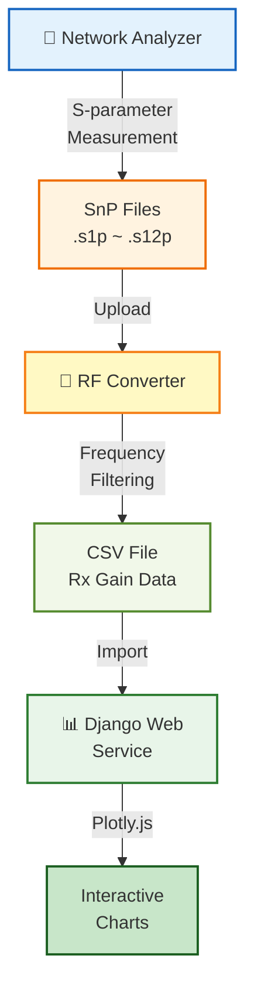

# Vertical Flow with Details - 세부 정보 포함

**용도**: 상세 보고서, 프로세스 문서
**대상**: 기술팀, 프로젝트 매니저

---

## 다이어그램

---

## 설명

세부 단계별 처리 과정:

1. **📡 Network Analyzer** - S-parameter 측정
2. **SnP Files** - .s1p ~ .s12p 형식 파일 생성
3. **🔄 RF Converter** - 파일 업로드 및 파싱
4. **CSV File** - Frequency Filtering 후 Rx Gain 데이터 추출
5. **📊 Django Web Service** - 데이터 Import
6. **Interactive Charts** - Plotly.js로 인터랙티브 차트 생성

---

## 특징

- ✅ 파일 형식 명시
- ✅ 각 단계별 처리 내용 표시
- ✅ 데이터 변환 과정 추적 가능
- ✅ 기술 문서에 적합

---

**파일명**: `02-vertical-flow-details.md`
**생성일**: 2025-10-27
