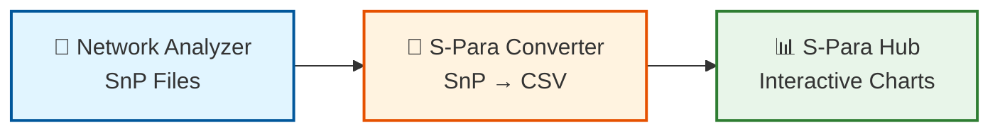
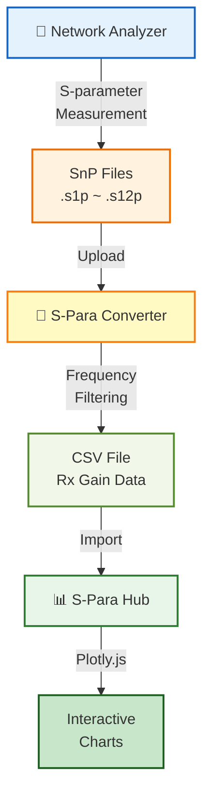
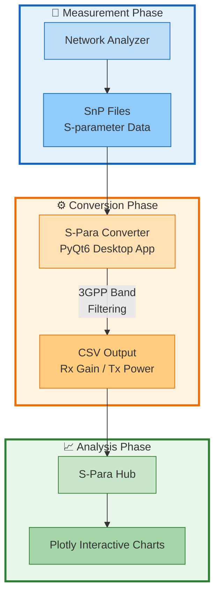
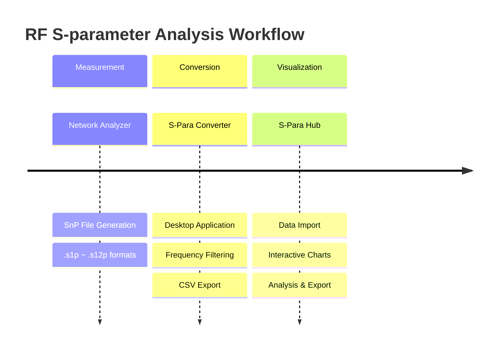
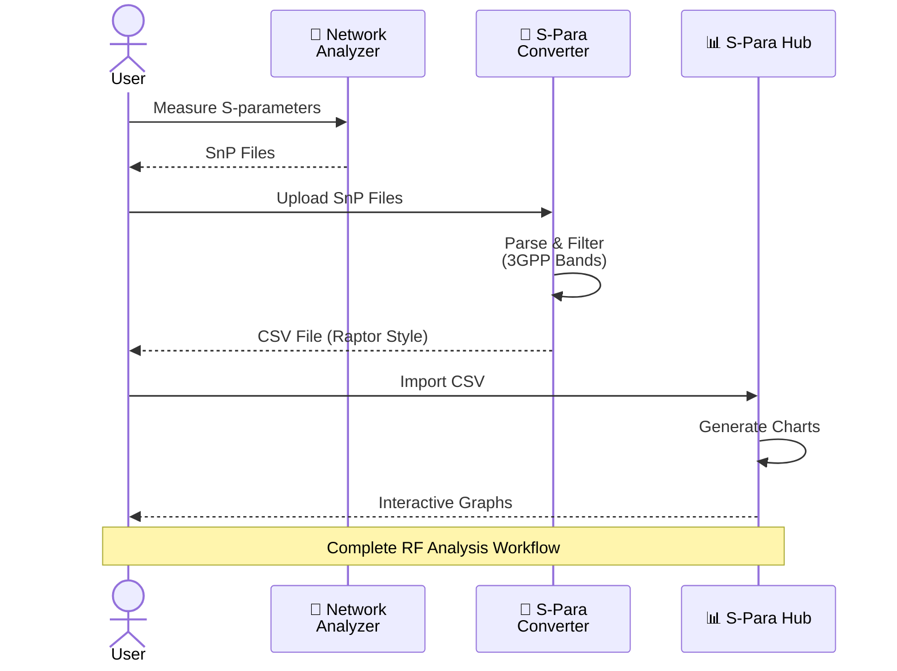
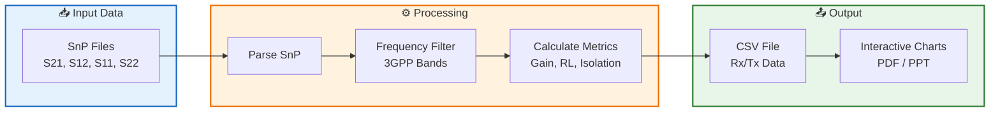
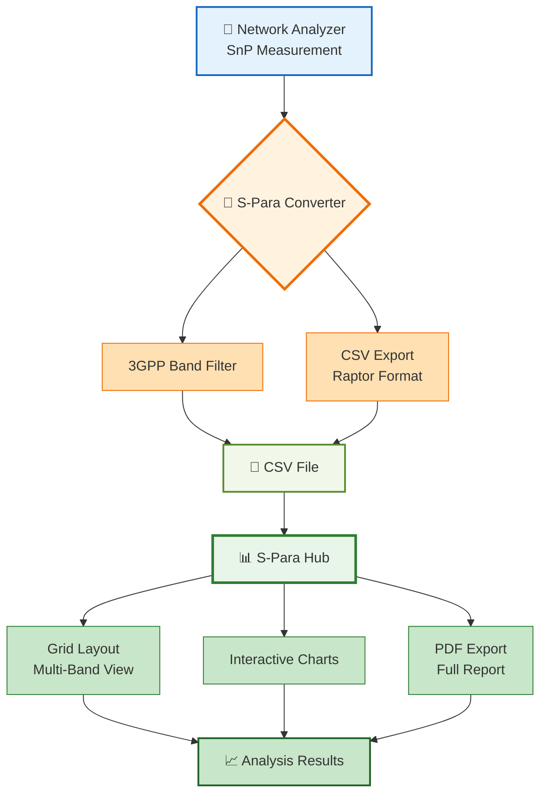
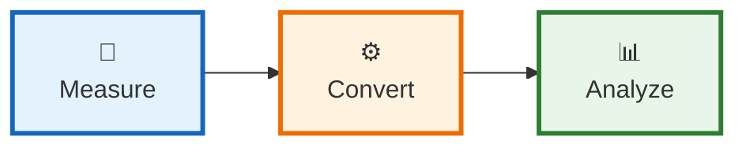
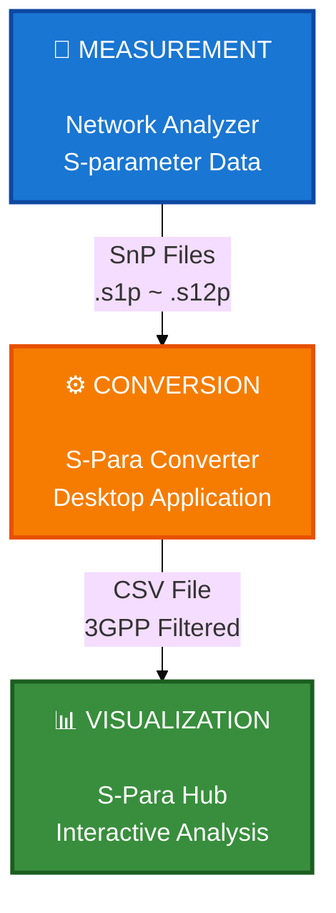

# RF S-parameter Analysis Workflow Diagrams

업무 보고서용 Mermaid 다이어그램 - 여러 스타일 제공

---

## 📊 Option 1: Simple Linear Flow (가장 심플)



**설명**: 가장 간단한 3단계 플로우

---

## 📊 Option 2: Vertical Flow with Details (세부 정보 포함)



**설명**: 세부 단계와 파일 형식 표시

---

## 📊 Option 3: System Architecture (시스템 구조도)



**설명**: 3개 페이즈로 구분된 시스템 구조

---

## 📊 Option 4: Timeline Flow (타임라인 스타일)



**설명**: 타임라인 형식 (Mermaid 최신 기능)

---

## 📊 Option 5: Detailed Sequence (상세 시퀀스)



**설명**: 사용자 인터랙션 중심 시퀀스 다이어그램

---

## 📊 Option 6: Data Flow (데이터 흐름 중심)



**설명**: 데이터 변환 과정 강조

---

## 📊 Option 7: Feature Highlights (기능 강조)



**설명**: 주요 기능 하이라이트

---

## 📊 Option 8: Executive Summary (경영진용 - 가장 심플)



**한 줄 설명**:
- **Measure**: Network Analyzer로 S-parameter 측정
- **Convert**: S-Para Converter로 CSV 변환 (주파수 필터링)
- **Analyze**: S-Para Hub에서 그래프 생성 및 분석

---

## 📊 Option 9: PPT-Ready Diagram (PPT 최적화)



**설명**: 큰 폰트, 강렬한 색상 (PPT 투영에 최적)

---

## 🎯 추천 다이어그램

### 1️⃣ **일반 보고서용**: Option 3 (System Architecture)
- 3개 페이즈 명확히 구분
- 전문적이고 체계적
- 기술 세부사항 포함

### 2️⃣ **경영진 보고용**: Option 8 (Executive Summary)
- 가장 심플
- 핵심만 전달
- 한눈에 이해 가능

### 3️⃣ **PPT 프레젠테이션용**: Option 9 (PPT-Ready)
- 큰 폰트, 강렬한 색상
- 프로젝터 투영에 최적
- 임팩트 있는 디자인

---

## 📝 사용 방법

### Markdown 지원 플랫폼
1. GitHub README.md
2. GitLab
3. Notion
4. Obsidian
5. VS Code (Markdown Preview Enhanced)

### PPT 변환
1. **온라인 렌더링**: https://mermaid.live/
2. **VS Code 확장**: Markdown Preview Mermaid Support
3. **스크린샷**: 렌더링 후 이미지로 저장 → PPT 삽입

### 색상 커스터마이징
```mermaid
%%{init: {'theme':'base', 'themeVariables': {
  'primaryColor':'#your-color',
  'primaryTextColor':'#fff',
  'fontSize':'16px'
}}}%%
```

---

**파일 위치**: `docs/workflow-diagrams.md`
**생성일**: 2025-10-27
**용도**: 업무 보고서, PPT 프레젠테이션, 기술 문서
